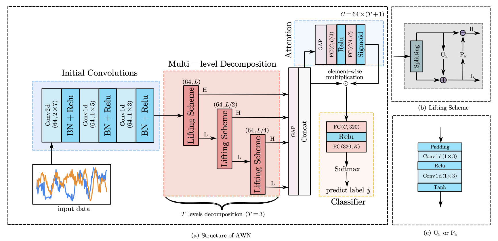
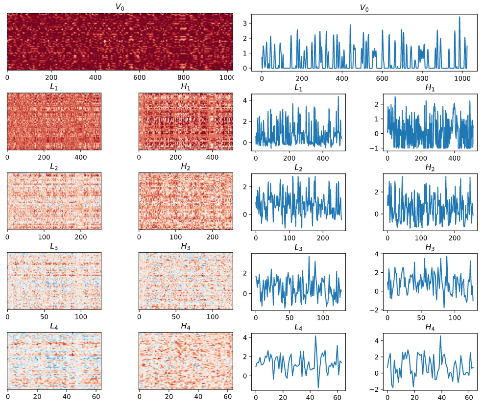

# AWN

Code for "Towards the Automatic Modulation Classification with Adaptive Wavelet Network".

Jiawei Zhang, Tiantian Wang, [Zhixi Feng](https://faculty.xidian.edu.cn/FZX/zh_CN/index.htm), and [Shuyuan Yang](https://web.xidian.edu.cn/syyang/)

Xidian University

[[Paper](https://ieeexplore.ieee.org/document/10058977)] | [[中文文档](doc-CN/README.md)] | [[code](https://github.com/zjwXDU/AWN)]



## Preparation

### Data

We conducted experiments on three datasets, namely RML2016.10a, RML2016.10b, and RML2018.01a.

| dataset     | modulation formats                                           | samples              |
| ----------- | ------------------------------------------------------------ | -------------------- |
| RML2016.10a | 8 digital formats: 8PSK, BPSK, CPFSK, GFSK, PAM4, 16QAM, 64QAM, QPSK; 3 analog formats: AM-DSB，AM-SSB，WBFM | 220 thousand (2×128) |
| RML2016.10b | 8 digital formats: 8PSK, BPSK, CPFSK, GFSK, PAM4, 16QAM, 64QAM, QPSK; 3 analog formats: AM-DSB，WBFM | 1.2 million (2×128)  |
| RML2018.01a | 19 digital formats: 32PSK, 16APSK, 32QAM, GMSK, 32APSK, OQPSK, 8ASK, BPSK, 8PSK, 4ASK, 16PSK, 64APSK, 128QAM, 128APSK, 64QAM, QPSK, 256QAM, OOK, 16QAM; 5 analog formats: AM-DSB-WC, AM-SSB-WC, AM-SSB-SC, AM-DSB-SC, FM, | 2.5 million (2×1024) |

The datasets can be downloaded from the [DeepSig](https://www.deepsig.ai/). Please extract the downloaded compressed file directly into the `./data` directory, and keep the file name unchanged. The final directory structure of `./data` should is shown below:

```
data
├── GOLD_XYZ_OSC.0001_1024.hdf5
├── RML2016.10a_dict.pkl
└── RML2016.10b.dat
```

### Pretrained Model

We provide pre-trained models on three datasets, which can be downloaded from [Google Drive](https://drive.google.com/file/d/1vJnjuPFFbraEc__F8AXhbzFyWwooMWoL/view?usp=share_link) or [Baidu Netdisk](https://pan.baidu.com/s/1GjITK7VL_PrIcbZ8zc3oSw?pwd=6znj). Please extract the downloaded compressed file directly into the `./checkpoint` directory.

### Environment Setup

- Python >= 3.6
- PyTorch >=1.7

This version of the code has been tested on Pytorch==1.8.1.

## Training

Run the following commands to train the AWN. (`<DATASET>` in {2016.10a, 2016.10b, 2018.01a}).

```
python main.py --mode train --dataset <DATASET>
```

The YAML configs for three datasets lies in `./config`.

After running the command, a new directory `<DATASET>_$` will be created in the `./training` directory, and `./models`, `./result`, `./log` directories will be created under `./<DATASET>_$`. The trained model will be saved to `./models`, and the training logs will be saved to `./log`. The loss, accuracy, and learning rate changes during training and validation will be plotted together in `./result`.

After the training is completed, an testing on the test set will be performed automatically, which can be referred to in the *Evaluation* section.

## Evaluation

Run the following command to evaluate the trained AWN:

```
python main.py --mode eval --dataset <DATASET>
```

After running the command, a new directory `<DATASET>_$` will be created in the `./inference` directory, which is consistent with the *Training* section. *The overall accuracy*, *macro F1-score*, and *Kappa coefficient* on the test set will be displayed in the terminal. The test logs will be saved to `./log`, and the accuracy curve with respect to SNRs and confusion matrix will be saved to `./result`.

If you have further analysis needs, we recommend modifying the `Run_Eval()` function to directly save the raw data, such as *Confmat_Set*.

### Adversarial / Spectral Perturbation Evaluation

We also provide an adversarial evaluation mode and a non-optimized spectral perturbation option:

```
# Carlini–Wagner (CW) attack
python main.py --mode adv_eval --dataset <DATASET> --attack cw --cw_steps 100 --cw_c 1.0

# Spectral tone (CW-jammer) without running CW optimization
python main.py --mode adv_eval --dataset <DATASET> --attack spectral \
  --spec_type cw_tone --spec_eps 0.1
```

Notes:
- `--attack cw` runs a standard CW-L2 attack; you can enable `--lowpass True` to low-pass filter the perturbation.
- `--attack spectral --spec_type cw_tone` adds a deterministic complex tone (I=cos, Q=sin) at a random frequency per sample. Control its strength via `--spec_eps` (L2 norm per sample) or `--spec_jnr_db` (jammer-to-noise ratio in dB). Optionally set `--tone_freq` in `[0, 0.5]` to fix the normalized digital frequency.
- `--attack spectral --spec_type psd_band` draws random band-limited complex noise with flat PSD between `--spec_band_low` and `--spec_band_high` (normalized frequencies in `[0, 0.5]`).
- `--attack spectral --spec_type psd_mask` loads a one-sided PSD mask from `--spec_mask_path` (a `.npy` file of length `T//2+1`, where `T` is the time length for your dataset) and synthesizes complex noise whose spectrum follows that mask.

Optional defenses (FFT-domain and AWN_All-style):

```
# Notch out the injected band in rFFT, then inverse RFFT
python main.py --mode adv_eval --dataset <DATASET> --attack spectral \
  --spec_type psd_band --spec_band_low 0.05 --spec_band_high 0.25 \
  --defense fft_notch --def_band_low 0.05 --def_band_high 0.25 --cmp_defense True

# Soft-notch with tapered transitions (set depth and transition bins)
python main.py --mode adv_eval --dataset <DATASET> --attack spectral \
  --spec_type psd_band --spec_band_low 0.05 --spec_band_high 0.25 \
  --defense fft_soft_notch --def_notch_depth 0.7 --def_notch_trans 4 --cmp_defense True

# Top-K FFT keep (AWN_All-style): keep only K largest FFT bins per channel
python main.py --mode adv_eval --dataset <DATASET> --attack spectral \
  --spec_type psd_band --spec_band_low 0.00 --spec_band_high 0.08 \
  --defense fft_topk --def_topk 50 --cmp_defense True

# Detector-gated Top-K (load AE, denoise only when KL>threshold)
python main.py --mode adv_eval --dataset <DATASET> --attack spectral \
  --spec_type psd_band --spec_band_low 0.00 --spec_band_high 0.08 \
  --defense ae_fft_topk --def_topk 50 \
  --detector_ckpt ./checkpoint/detector_ae.pth --detector_threshold 0.004468
```
- `--defense fft_notch` (alias `idfft_notch`) zeros the specified band in the one-sided rFFT per I/Q channel, then applies inverse RFFT to recover the time signal.
- `--defense fft_soft_notch` applies a soft (tapered) notch with configurable depth and transition width.
- `--defense fft_topk` keeps only the K largest FFT coefficients per sample/channel and inverse-FFTs (as used in `AWN_All.py`).
- `--defense ae_fft_topk` loads an optional 1D conv autoencoder (AE) as an anomaly detector; it computes a timewise KL divergence between the normalized input and its reconstruction. Only samples with KL above `--detector_threshold` are denoised via Top-K; others pass through unchanged.
- Use `--cmp_defense True` to log accuracy before and after defense in one run.

Low-frequency attacks and recovery:

```
# Generate low-frequency band-limited perturbations and recover via auto soft-notch
python main.py --mode adv_eval --dataset <DATASET> --attack spectral \
  --spec_type psd_band --spec_band_low 0.00 --spec_band_high 0.08 --spec_eps 0.1 \
  --defense auto_soft_notch --def_auto_fmax 0.08 --cmp_defense True

# Alternatively, use high-pass differencing or Top-K
python main.py --mode adv_eval --dataset <DATASET> --attack spectral \
  --spec_type psd_band --spec_band_low 0.00 --spec_band_high 0.08 --spec_eps 0.1 \
  --defense highpass_diff --def_hp_order 1 --cmp_defense True
```
The logs show pre-/post-defense accuracy so you can verify whether accuracy recovers under low-frequency perturbations.

## Adversarial Quickstart: CW, Low-Frequency, IDFFT Recovery, and Visualization

This section collects the main commands to reproduce CW and low‑frequency attacks,
recover them with IDFT‑based filtering, and visualize frequency/IQ changes.

- Prerequisites
  - Install: `pip install torchattacks` (for CW backend).
  - Have a pretrained checkpoint in `./checkpoint` or project root (e.g., `2016.10a_AWN.pkl`).

- Clean sanity check (e.g., QPSK@SNR=0)
  - `python main.py --mode eval --dataset 2016.10a --snr_filter 0 --mod_filter QPSK --eval_limit 64`

- CW attack (Carlini–Wagner)
  - Basic: `python main.py --mode adv_eval --dataset 2016.10a --attack cw \
      --attack_backend torchattacks --cw_steps 100 --cw_c 1.0`
  - Reduce magnitude (easier to recover): add `--cw_scale 0.3` (post‑scale delta to 30%).
  - Internal fallback (no torchattacks): `--attack_backend internal`.

- Low‑frequency attacks (no optimizer)
  - Single tone: `--attack spectral --spec_type cw_tone --tone_freq 0.02 --spec_eps 0.25`
  - Band‑limited noise: `--attack spectral --spec_type psd_band \
      --spec_band_low 0.00 --spec_band_high 0.05 --spec_eps 0.25`

- IDFFT/FFT‑domain recovery
  - IDFT notch (rFFT→zero band→iRFFT): `--defense fft_notch --def_band_low 0.00 --def_band_high 0.08`
  - Soft notch (tapered): `--defense fft_soft_notch --def_band_low 0.00 --def_band_high 0.08 \
      --def_notch_depth 0.6 --def_notch_trans 4`
  - Adaptive notch (auto peak in low band): `--defense auto_soft_notch --def_auto_fmax 0.1`
  - Top‑K FFT keep (IFFT): `--defense fft_topk --def_topk 50` (AWN_All style; normalize inside code).
  - Compare pre/post in one run: add `--cmp_defense True`.

- Practical examples (2016.10a)
  - CW (torchattacks) + soft‑notch, QPSK@SNR=18, small slice:
    - `python main.py --mode adv_eval --dataset 2016.10a --attack cw --attack_backend torchattacks \
       --cw_c 0.01 --cw_steps 5 --cw_scale 0.2 --cmp_defense True \
       --defense auto_soft_notch --def_auto_fmax 0.1 --snr_filter 18 --mod_filter QPSK --eval_limit 64`
  - Low‑frequency tone + notch, QPSK@SNR=0:
    - `python main.py --mode adv_eval --dataset 2016.10a --attack spectral --spec_type cw_tone \
       --tone_freq 0.02 --spec_eps 0.25 --cmp_defense True \
       --defense fft_notch --def_band_low 0.00 --def_band_high 0.05 --snr_filter 0 --mod_filter QPSK`

- Frequency and grid visualizations
  - Per‑sample time/FFT/IQ comparison (saves PNGs under `cw_analysis/`):
    - `python visualize_cw_fft.py`
    - Works with torchattacks if available; otherwise falls back to internal CW.
  - Grid view across modulations (I/Q scatter grids + avg |FFT|):
    - `python visualize_cw_iq_freq_grid.py --snr 18 --samples_per_mod 500 --cw_steps 100 --topk 50 --ta_box minmax`
    - Outputs: `cw_analysis/iq_grid.png`, `cw_analysis/freq_grid.png`, and `cw_analysis/accuracy_diff.json`.
  - Spectrum/energy summary for a few samples:
    - `python analyze_freq_spectrum.py`

Notes
- `fft_notch` and `fft_soft_notch` operate via rFFT per channel and reconstruct with inverse RFFT (IDFFT).
- `fft_topk` uses complex FFT/IFFT and keeps K largest coefficients per channel.
- Use `--mod_filter` and `--snr_filter` to limit slices while iterating; `--eval_limit` speeds experiments.

## Visualize



We provide an additional mode to visualize the decomposition of the feature maps by the adaptive lifting scheme, which can be called by the following command:

```
python main.py --mode visualize --dataset <DATASET>
```

Similar to *Evaluation*, the plotted figures are stored in `./result` in the form of `.svg`.

## Acknowledgments

Some of the code is borrowed from [DAWN](https://github.com/mxbastidasr/DAWN_WACV2020). We sincerely thank them for their outstanding work.

## License

This code is distributed under an [MIT LICENSE](https://github.com/zjwXDU/AWN/blob/main/LICENSE). Note that our code depends on other libraries and datasets which each have their own respective licenses that must also be followed.

## Citation

Please consider citing our paper if you find it helpful in your research:

```
@ARTICLE{10058977,
	author={Zhang, Jiawei and Wang, Tiantian and Feng, Zhixi and Yang, Shuyuan},
	journal={IEEE Transactions on Cognitive Communications and Networking}, 
	title={Towards the Automatic Modulation Classification with Adaptive Wavelet Network}, 
	year={2023},
	doi={10.1109/TCCN.2023.3252580}
}
```


Contact at: zjw AT stu DOT xidian DOT edu DOT cn
