# Adaptive-K FFT Defense for CW Attack Recovery

## Threat Model

### 1. System Under Protection

A **DNN-based Automatic Modulation Classification (AMC)** receiver deployed within an RF spectrum management system. Three real-world deployment contexts motivate this work:

#### 1a. ITU/FCC Spectrum Monitoring Station

National regulatory agencies (FCC Enforcement Bureau, ITU Regional Monitoring Stations, Ofcom UK) deploy automated monitoring stations to detect unauthorized transmissions and classify signal types for enforcement. The R&S ARGUS or TCI 740 series receivers digitize wideband RF and feed IQ to classification engines.

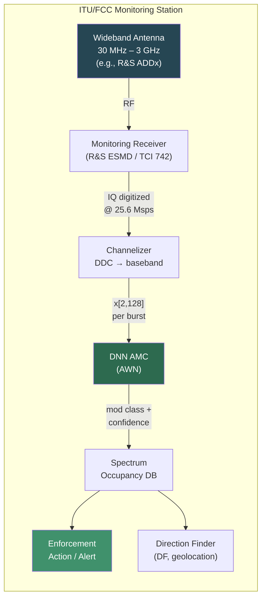
```mermaid
graph LR
    subgraph "ITU/FCC Monitoring Station"
        ANT["Wideband Antenna<br/>30 MHz – 3 GHz<br/>(e.g., R&S ADDx)"] -->|"RF"| RCV["Monitoring Receiver<br/>(R&S ESMD / TCI 742)"]
        RCV -->|"IQ digitized<br/>@ 25.6 Msps"| DSP["Channelizer<br/>DDC → baseband"]
        DSP -->|"x[2,128]<br/>per burst"| AMC["DNN AMC<br/>(AWN)"]
        AMC -->|"mod class +<br/>confidence"| DB["Spectrum<br/>Occupancy DB"]
        DB --> ENF["Enforcement<br/>Action / Alert"]
        DB --> DF["Direction Finder<br/>(DF, geolocation)"]
    end

    style ANT fill:#264653,color:#fff
    style AMC fill:#2d6a4f,color:#fff
    style ENF fill:#40916c,color:#fff
```

#### 1b. CBRS SAS / ESC (FCC Part 96)

The 3.5 GHz Citizens Broadband Radio Service (CBRS) uses an Environmental Sensing Capability (ESC) to detect incumbent Navy radar and redirect commercial users. SAS (Spectrum Access System) operators like Google, Federated Wireless, and CommScope rely on AMC to distinguish LTE-TDD from pulsed radar and amateur signals in the 3550–3700 MHz band.

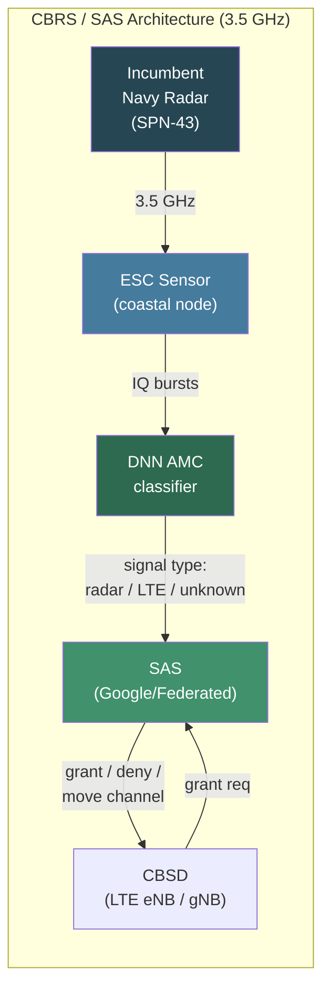
```mermaid
graph LR
    subgraph "CBRS / SAS Architecture (3.5 GHz)"
        INC["Incumbent<br/>Navy Radar<br/>(SPN-43)"] -->|"3.5 GHz"| ESC["ESC Sensor<br/>(coastal node)"]
        CBSD["CBSD<br/>(LTE eNB / gNB)"] -->|"grant req"| SAS["SAS<br/>(Google/Federated)"]
        ESC -->|"IQ bursts"| AMC["DNN AMC<br/>classifier"]
        AMC -->|"signal type:<br/>radar / LTE / unknown"| SAS
        SAS -->|"grant / deny /<br/>move channel"| CBSD
    end

    style INC fill:#264653,color:#fff
    style ESC fill:#457b9d,color:#fff
    style AMC fill:#2d6a4f,color:#fff
    style SAS fill:#40916c,color:#fff
```

#### 1c. Military ESM / ELINT Receiver

Electronic Support Measures (ESM) systems on naval vessels (AN/SLQ-32, CESM on Halifax-class frigates) and airborne platforms (AN/ALQ-218) perform real-time modulation classification to identify emitter types and build the Electronic Order of Battle (EOB). Modern ESM replaces lookup-table classifiers with DNN-based AMC for novel waveform recognition.

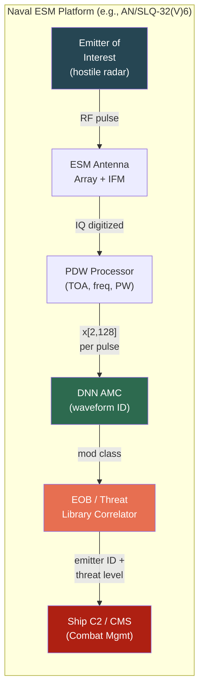
```mermaid
graph LR
    subgraph "Naval ESM Platform (e.g., AN/SLQ-32(V)6)"
        EM["Emitter of<br/>Interest<br/>(hostile radar)"] -->|"RF pulse"| RWR["ESM Antenna<br/>Array + IFM"]
        RWR -->|"IQ digitized"| PDW["PDW Processor<br/>(TOA, freq, PW)"]
        PDW -->|"x[2,128]<br/>per pulse"| AMC["DNN AMC<br/>(waveform ID)"]
        AMC -->|"mod class"| EOB["EOB / Threat<br/>Library Correlator"]
        EOB -->|"emitter ID +<br/>threat level"| C2["Ship C2 / CMS<br/>(Combat Mgmt)"]
    end

    style EM fill:#264653,color:#fff
    style AMC fill:#2d6a4f,color:#fff
    style EOB fill:#e76f51,color:#fff
    style C2 fill:#ae2012,color:#fff
```

| Component | Specification |
|-----------|--------------|
| Signal format | Complex baseband IQ, 2 channels x 128 samples |
| Modulation classes | 11 (BPSK, QPSK, 8PSK, QAM16, QAM64, PAM4, CPFSK, GFSK, AM-DSB, AM-SSB, WBFM) |
| Operating SNR | 0 -- 18 dB (field-realistic range) |
| Classifier | AWN (Adaptive Wavelet Network), 91.1% clean accuracy at SNR >= 0 |
| Deployment contexts | ITU/FCC monitoring, CBRS ESC/SAS, military ESM/ELINT |
| Commonality | Non-cooperative monitoring -- no coordination with the transmitter |

### 2. Adversary Model

#### 2.1 Adversary Goal

**Primary**: Cause the AMC to misclassify received signals (untargeted evasion). A secondary objective is to remain covert -- the perturbation should be difficult to detect by energy-based or spectral anomaly detectors at the receiver.

| Objective | Description |
|-----------|-------------|
| Untargeted misclassification | Any wrong class prediction degrades the monitoring system |
| Low detectability | Perturbation should not trigger conventional RF anomaly detectors |
| Persistence | Attack succeeds across multiple SNR conditions and modulation types |

#### 2.2 Adversary Knowledge (White-Box)

We evaluate under the **strongest adversary assumption** to establish a worst-case defense baseline:

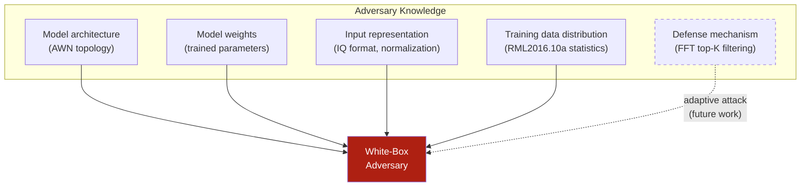
```mermaid
graph TD
    subgraph Adversary Knowledge
        K1["Model architecture<br/>(AWN topology)"]
        K2["Model weights<br/>(trained parameters)"]
        K3["Input representation<br/>(IQ format, normalization)"]
        K4["Training data distribution<br/>(RML2016.10a statistics)"]
        K5["Defense mechanism<br/>(FFT top-K filtering)"]
    end

    K1 --> WB["White-Box<br/>Adversary"]
    K2 --> WB
    K3 --> WB
    K4 --> WB
    K5 -.->|"adaptive attack<br/>(future work)"| WB

    style WB fill:#ae2012,color:#fff
    style K5 stroke-dasharray: 5 5
```

| Knowledge | Level | Justification |
|-----------|-------|---------------|
| Model architecture | Full | Assumes reverse-engineering or insider access |
| Model weights | Full | Worst-case; enables gradient-based attacks |
| Input normalization | Full | IQ range, minmax mapping known |
| Defense mechanism | Unknown | Defender deploys spectral filtering without disclosure |
| True signal content | None | Adversary does not know the legitimate waveform per-burst |

#### 2.3 Adversary Capabilities

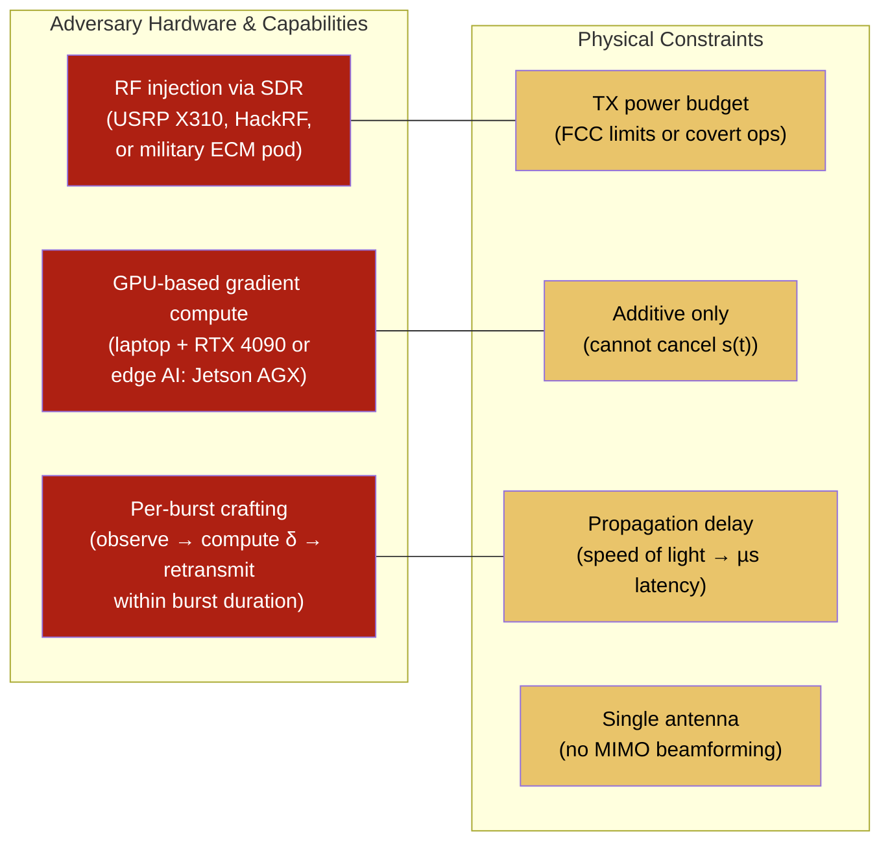
```mermaid
graph LR
    subgraph "Adversary Hardware & Capabilities"
        direction TB
        C1["RF injection via SDR<br/>(USRP X310, HackRF,<br/>or military ECM pod)"]
        C2["GPU-based gradient compute<br/>(laptop + RTX 4090 or<br/>edge AI: Jetson AGX)"]
        C3["Per-burst crafting<br/>(observe → compute δ → retransmit<br/>within burst duration)"]
    end

    subgraph "Physical Constraints"
        direction TB
        L1["TX power budget<br/>(FCC limits or covert ops)"]
        L2["Additive only<br/>(cannot cancel s(t))"]
        L3["Propagation delay<br/>(speed of light → µs latency)"]
        L4["Single antenna<br/>(no MIMO beamforming)"]
    end

    C1 --- L1
    C2 --- L2
    C3 --- L3

    style C1 fill:#ae2012,color:#fff
    style C2 fill:#ae2012,color:#fff
    style C3 fill:#ae2012,color:#fff
    style L1 fill:#e9c46a,color:#000
    style L2 fill:#e9c46a,color:#000
    style L3 fill:#e9c46a,color:#000
    style L4 fill:#e9c46a,color:#000
```

| Capability | Detail | Real-World Analogue |
|------------|--------|---------------------|
| **Injection method** | Additive over-the-air: adversary transmits `delta(t)` on the same frequency as the legitimate signal. The receiver observes `r(t) = s(t) + delta(t) + n(t)`. | SDR-based jammer (USRP B210/X310 with GNURadio), military ECM pod (AN/ALQ-99), or rogue CBSD with modified firmware |
| **Optimization** | CW L2 attack (Carlini & Wagner) with full gradient access. Minimizes `||delta||_2` subject to misclassification with confidence margin kappa. | Edge AI compute (NVIDIA Jetson AGX, laptop GPU) co-located with TX — feasible for 128-sample bursts at ~10 ms/burst |
| **Per-burst crafting** | Adversary computes a unique perturbation for each observed burst (strongest possible attack; weaker universal perturbations are a subset). | Full-duplex SDR (separate RX/TX chains) intercepts burst, computes perturbation, retransmits. Requires < 1 ms latency for tactical scenarios |
| **Power budget** | Perturbation norm implicitly constrained by CW's L2 minimization objective (c=1.0, kappa=1.0). Typical perturbation power is 10-20 dB below signal power. | Low-power injection: -20 dBc relative to signal ≈ 10 µW if signal is 1 mW — well within SDR TX range and below energy detection thresholds |
| **Temporal** | Reactive -- adversary intercepts the signal, computes perturbation, and retransmits within the burst duration. Assumes sufficient compute for real-time CW optimization. | Store-and-forward: capture burst into FPGA buffer, GPU computes δ, DAC retransmits. Achievable with USRP X310 + GPU pipeline |

#### 2.4 Adversary Limitations

| Constraint | Impact |
|------------|--------|
| Additive-only injection | Cannot cancel or replace signal components; legitimate signal energy persists in the received waveform |
| No channel knowledge | Perturbation passes through an unknown channel `h(t)` which may distort the attack |
| L2 minimization | CW inherently minimizes perturbation norm, limiting per-bin energy -- this is the fundamental weakness exploited by spectral filtering |
| Causal processing | Real-time latency constraint limits attack optimization budget (steps, iterations) |

#### 2.5 Why L2-Minimal (CW) Attacks — Receiver Pipeline Constraints

A natural question is: *why would an adversary choose an L2-minimal attack like CW, rather than simply blasting high-power interference?* The answer lies in the multi-stage receiver pipeline that sits before the AMC classifier. Real RF monitoring systems enforce implicit constraints on received signal statistics through front-end processing stages. These stages are not security mechanisms per se, but they create an environment where high-energy or spectrally concentrated perturbations are more likely to be detected, flagged, or distorted before reaching the DNN.

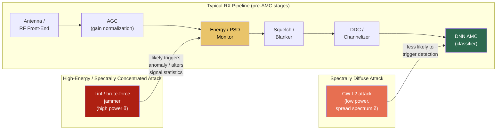
```mermaid
graph LR
    subgraph "Typical RX Pipeline (pre-AMC stages)"
        ANT["Antenna /<br/>RF Front-End"] --> AGC["AGC<br/>(gain normalization)"]
        AGC --> ED["Energy / PSD<br/>Monitor"]
        ED --> SQ["Squelch /<br/>Blanker"]
        SQ --> DDC["DDC /<br/>Channelizer"]
        DDC --> AMC["DNN AMC<br/>(classifier)"]
    end

    subgraph "High-Energy / Spectrally Concentrated Attack"
        HE["Linf / brute-force<br/>jammer<br/>(high power δ)"] -->|"likely triggers<br/>anomaly / alters<br/>signal statistics"| ED
    end

    subgraph "Spectrally Diffuse Attack"
        LE["CW L2 attack<br/>(low power,<br/>spread spectrum δ)"] -->|"less likely to<br/>trigger detection"| AMC
    end

    style HE fill:#ae2012,color:#fff
    style LE fill:#e76f51,color:#fff
    style ED fill:#e9c46a,color:#000
    style AMC fill:#2d6a4f,color:#fff
```

**Front-end stages and their effect on adversarial perturbations:**

| Stage | Primary function | Effect on high-energy / concentrated attacks |
|-------|-----------------|----------------------------------------------|
| **AGC (Automatic Gain Control)** | Keeps received power within ADC dynamic range | Does **not** reject signals — but gain reduction compresses the perturbation-to-signal ratio. A large δ that saturates the ADC triggers AGC scaling that diminishes the perturbation's relative effect. AGC is not a defense, but it imposes an implicit power constraint. |
| **Energy / PSD monitor** | Logs or flags deviations from expected band power profile | High-energy perturbation raises total power or per-channel PSD. Depending on system design, this may trigger an anomaly flag, log entry, or operator alert — but not necessarily a hard reject. |
| **Squelch / blanker** | Gates intervals with abnormal energy (common in radar/ESM) | Impulsive or bursty high-energy interference may be blanked. Continuous low-level perturbation typically passes through. |
| **CFAR detector** (radar/ESM) | Adaptive threshold detection for target extraction | Elevated noise floor from high-energy injection can distort CFAR thresholds, potentially triggering alarms. Low-level perturbation stays within the adaptive threshold margin. |

> **Important caveat.** These stages do not constitute a security boundary. Many operational systems do not hard-reject anomalous signals but rather log, deprioritize, or pass them with metadata flags. The argument is probabilistic: high-energy perturbations are *more likely* to trigger some form of detection or distortion at these stages, while spectrally diffuse perturbations are *less likely* to do so.

**Why CW L2 is less likely to trigger detection — the "spectrally diffuse" property:**

The key is not merely "low energy" but the **spectral profile** of the perturbation. CW L2 minimizes `||δ||_2`, which has a specific consequence in the frequency domain: the perturbation energy is spread thinly across many FFT bins, resembling a slight elevation of the noise floor rather than a localized spectral anomaly.

| Attack type | Spectral profile | Detection likelihood |
|-------------|-----------------|---------------------|
| **Linf (FGSM, PGD)** | Spectrally concentrated — perturbation is bounded per-sample, creating impulsive or narrowband features | Higher — spectral spikes or power deviations more likely to trigger PSD monitors or CFAR |
| **L2-minimal (CW, DeepFool, EAD)** | Spectrally diffuse — total energy is minimized, spreading perturbation thinly across time and frequency | Lower — resembles channel noise elevation; no individual bin shows a suspicious spike |

Concretely for CW with typical parameters (c=1.0, kappa=1.0):

1. **AGC is not affected** — perturbation adds negligible power (~-20 dBc), so gain setting remains unchanged and the perturbation-to-signal ratio is preserved
2. **PSD monitors are unlikely to flag** — per-bin perturbation energy is comparable to thermal noise floor variation, not a clear spectral anomaly
3. **The perturbation resembles channel noise** — it is spectrally diffuse and low-amplitude, making it difficult to distinguish from normal propagation-induced distortion (multipath, fading, interference margin)
4. **Yet it shifts DNN decision boundaries** — DNNs are sensitive to structured perturbations even at amplitudes below the noise floor, because the perturbation is optimized along the model's gradient direction

This creates a fundamental asymmetry that motivates our threat model:

> High-energy or spectrally concentrated attacks (FGSM, PGD with large ε) are effective against the DNN in isolation, but are more likely to be detected or distorted by conventional RF front-end processing. L2-constrained attacks (CW, DeepFool, EAD) are **spectrally diffuse** — their low-amplitude, spread-spectrum nature makes them less likely to trigger detection at any individual pipeline stage, allowing them to survive to the AMC classifier with higher probability.

This is precisely why our defense focuses on CW-type attacks, and why the defense mechanism (spectral filtering) exploits the same property that makes CW stealthy: the perturbation is spectrally diffuse, so retaining only the top-K magnitude bins discards most of the attack energy while preserving the signal's dominant spectral structure.

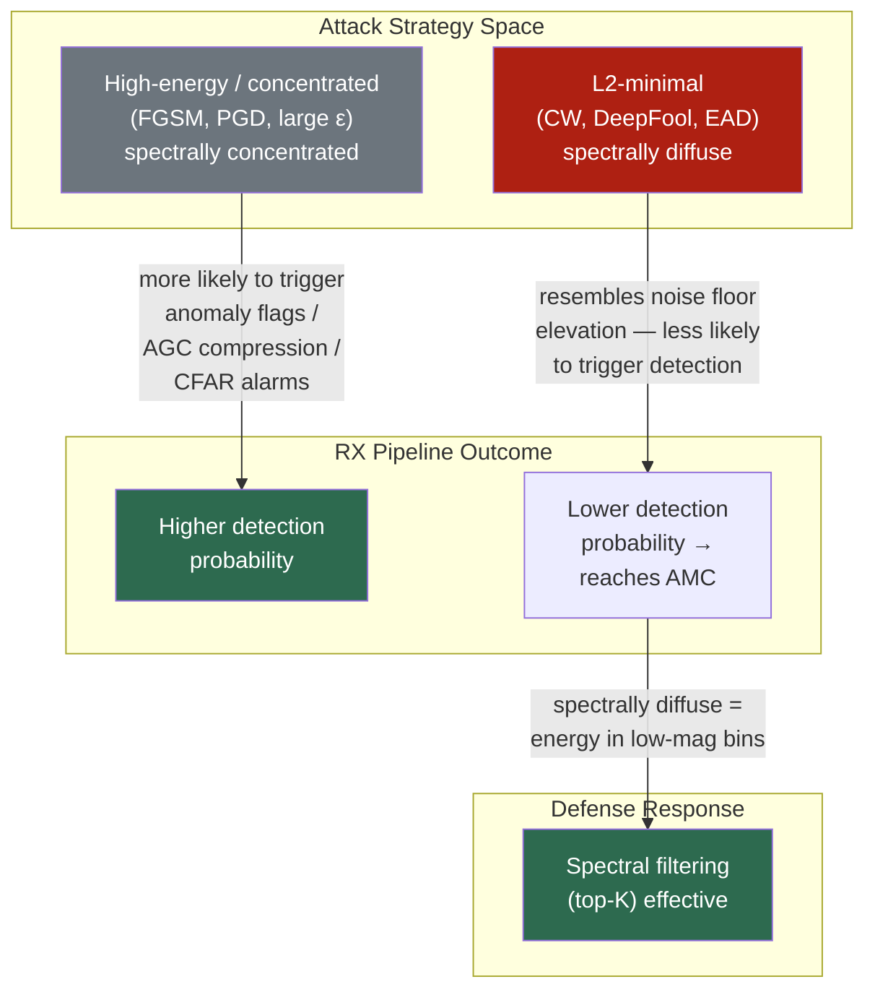
```mermaid
graph TD
    subgraph "Attack Strategy Space"
        HI["High-energy / concentrated<br/>(FGSM, PGD, large ε)<br/>spectrally concentrated"]
        LO["L2-minimal<br/>(CW, DeepFool, EAD)<br/>spectrally diffuse"]
    end

    subgraph "RX Pipeline Outcome"
        HI -->|"more likely to trigger<br/>anomaly flags /<br/>AGC compression /<br/>CFAR alarms"| BLOCK["Higher detection<br/>probability"]
        LO -->|"resembles noise floor<br/>elevation — less likely<br/>to trigger detection"| REACH["Lower detection<br/>probability →<br/>reaches AMC"]
    end

    subgraph "Defense Response"
        REACH -->|"spectrally diffuse =<br/>energy in low-mag bins"| DEF["Spectral filtering<br/>(top-K) effective"]
    end

    style HI fill:#6c757d,color:#fff
    style LO fill:#ae2012,color:#fff
    style BLOCK fill:#2d6a4f,color:#fff
    style DEF fill:#2d6a4f,color:#fff
```

> **Scope limitation.** Our experiments operate at baseband (post-DDC IQ samples) and do not include a full RF front-end simulation with AGC, CFAR, or energy detection. The argument above is a design rationale for why L2-minimal attacks are the most relevant threat class for AMC systems, not an empirical measurement of detection probability at each pipeline stage. Validating detection rates under realistic front-end processing is important future work.

### 3. Attack Surface

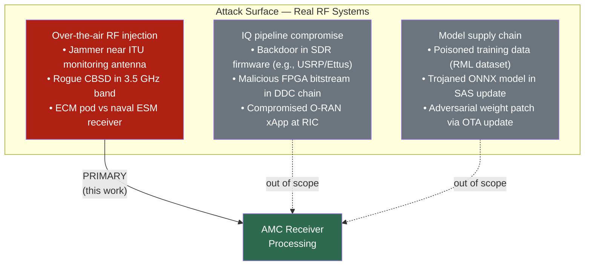
```mermaid
graph TB
    subgraph "Attack Surface — Real RF Systems"
        AS1["Over-the-air RF injection<br/>• Jammer near ITU monitoring antenna<br/>• Rogue CBSD in 3.5 GHz band<br/>• ECM pod vs naval ESM receiver"]
        AS2["IQ pipeline compromise<br/>• Backdoor in SDR firmware (e.g., USRP/Ettus)<br/>• Malicious FPGA bitstream in DDC chain<br/>• Compromised O-RAN xApp at RIC"]
        AS3["Model supply chain<br/>• Poisoned training data (RML dataset)<br/>• Trojaned ONNX model in SAS update<br/>• Adversarial weight patch via OTA update"]
    end

    AS1 -->|"PRIMARY<br/>(this work)"| RCV["AMC Receiver<br/>Processing"]
    AS2 -.->|"out of scope"| RCV
    AS3 -.->|"out of scope"| RCV

    style AS1 fill:#ae2012,color:#fff
    style AS2 fill:#6c757d,color:#fff
    style AS3 fill:#6c757d,color:#fff
    style RCV fill:#2d6a4f,color:#fff
```

This work addresses **over-the-air adversarial perturbation** (AS1) only — the physically realistic scenario where an adversary co-located with the transmitter or operating a nearby jammer injects crafted perturbations into the wireless channel. This maps directly to:
- **Spectrum monitoring**: Unauthorized transmitter operating near FCC monitoring antenna adds adversarial overlay to evade classification
- **CBRS**: Malicious CBSD or interference source in the 3.5 GHz band confuses ESC sensor classification of incumbent radar vs LTE
- **Military ESM**: Electronic countermeasure (ECM) system transmits adversarial perturbation to deny modulation identification by AN/SLQ-32

Digital-domain attacks (AS2: IQ buffer injection via compromised SDR firmware or O-RAN xApp) and supply-chain attacks (AS3: poisoned model weights) are out of scope.

### 4. Defense Model

#### 4.1 Defender Knowledge & Assumptions

| Assumption | Rationale |
|------------|-----------|
| No adversary cooperation | Defender cannot query or probe the adversary |
| No clean reference | Defender has no paired clean signal for comparison |
| Signal-processing only | Defense must not require model inference for K estimation (avoids adversarial feedback loops) |
| Modulation-agnostic | Defense operates identically regardless of the true underlying modulation |
| Causal & real-time | Defense runs per-burst with no lookahead or cross-burst memory |

#### 4.2 Defense Mechanism

Spectral magnitude knee detection followed by FFT top-K filtering:

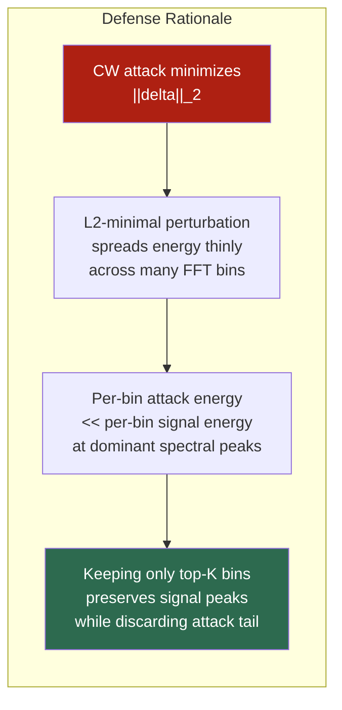
```mermaid
graph LR
    subgraph Defense Rationale
        P1["CW attack minimizes<br/>||delta||_2"]
        P2["L2-minimal perturbation<br/>spreads energy thinly<br/>across many FFT bins"]
        P3["Per-bin attack energy<br/><< per-bin signal energy<br/>at dominant spectral peaks"]
        P4["Keeping only top-K bins<br/>preserves signal peaks<br/>while discarding attack tail"]
    end

    P1 --> P2 --> P3 --> P4

    style P1 fill:#ae2012,color:#fff
    style P4 fill:#2d6a4f,color:#fff
```

**Core insight**: CW L2 minimizes total perturbation energy, which forces the adversary to spread its power budget across many frequency bins. At each individual bin, the attack contribution is small relative to the legitimate signal's dominant spectral peaks. The magnitude knee identifies where signal energy transitions to attack+noise energy, and top-K filtering removes everything below that boundary.

#### 4.3 Security Properties

| Property | Status | Note |
|----------|--------|------|
| No model dependency | Yes | K estimated from signal spectrum alone |
| Graceful degradation | Yes | If no attack present, defense preserves 70-91% clean accuracy (K-dependent) |
| Attack-agnostic | Partial | Tuned for L2-minimal attacks (CW, DeepFool, EAD); Linf attacks (FGSM, PGD) have different spectral profiles |
| Adaptive attack resistant | Open | If adversary knows the defense, they could concentrate perturbation into top-K bins (future work) |

### 5. Threat Scenarios

> **Framing note.** Across all scenarios, AMC acts as an *upstream perception module* whose outputs influence downstream automated or human-in-the-loop decisions. Rather than directly causing system failure, adversarial AMC attacks operate by subtly biasing control-plane perception, leading to degraded or delayed decision-making in downstream pipelines. Real-world systems are multi-stage: AMC is one decision signal among several (energy detection, direction finding, protocol decoding, human review). The threat is not that AMC alone dictates the outcome, but that misclassification at this stage can suppress alarms, deprioritize signals, or bias subsequent analysis.

#### Scenario 1: FCC/ITU Spectrum Enforcement Evasion

An unlicensed operator (e.g., pirate FM broadcaster, illegal LTE repeater) adds an adversarial overlay to its transmission. Many monitoring systems rely on automated classification pipelines to prioritize signals for human or rule-based analysis. Misclassification at the AMC stage can suppress downstream alarms or deprioritize signals in automated monitoring workflows — e.g., QAM64 LTE is tagged as benign WBFM, reducing the likelihood of triggering further inspection or escalation by the enforcement bureau.

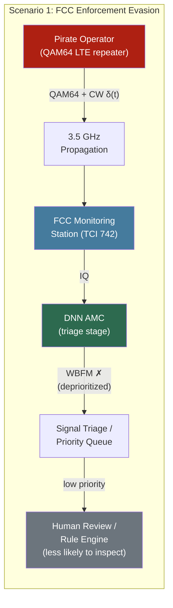
```mermaid
graph LR
    subgraph "Scenario 1: FCC Enforcement Evasion"
        PIR["Pirate Operator<br/>(QAM64 LTE repeater)"] -->|"QAM64 + CW δ(t)"| AIR["3.5 GHz<br/>Propagation"]
        AIR --> MON["FCC Monitoring<br/>Station (TCI 742)"]
        MON -->|"IQ"| AMC1["DNN AMC<br/>(triage stage)"]
        AMC1 -->|"WBFM ✗<br/>(deprioritized)"| LOG["Signal Triage /<br/>Priority Queue"]
        LOG -->|"low priority"| ENF["Human Review /<br/>Rule Engine<br/>(less likely to inspect)"]
    end

    style PIR fill:#ae2012,color:#fff
    style MON fill:#457b9d,color:#fff
    style AMC1 fill:#2d6a4f,color:#fff
    style ENF fill:#6c757d,color:#fff
```

#### Scenario 2: CBRS Band Incumbent Detection Bias

A malicious or malfunctioning CBSD in the 3550–3700 MHz CBRS band transmits adversarial perturbation that biases the ESC sensor's signal characterization pipeline. AMC contributes to signal characterization used by ESC systems alongside energy detection and pulse descriptor analysis. Misclassification may bias the signal interpretation pipeline, potentially affecting spectrum access decisions — if the incumbent radar signature is mischaracterized, it increases the probability that the SAS grants access that should have been withheld.

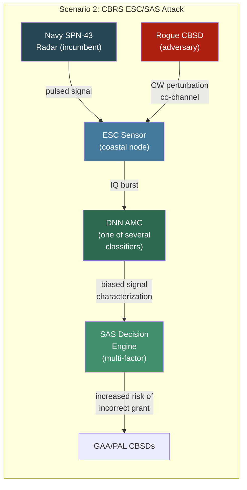
```mermaid
graph LR
    subgraph "Scenario 2: CBRS ESC/SAS Attack"
        RADAR["Navy SPN-43<br/>Radar (incumbent)"] -->|"pulsed signal"| ESC["ESC Sensor<br/>(coastal node)"]
        ROGUE["Rogue CBSD<br/>(adversary)"] -->|"CW perturbation<br/>co-channel"| ESC
        ESC -->|"IQ burst"| AMC2["DNN AMC<br/>(one of several<br/>classifiers)"]
        AMC2 -->|"biased signal<br/>characterization"| SAS2["SAS Decision<br/>Engine<br/>(multi-factor)"]
        SAS2 -->|"increased risk of<br/>incorrect grant"| CBSD2["GAA/PAL CBSDs"]
    end

    style ROGUE fill:#ae2012,color:#fff
    style ESC fill:#457b9d,color:#fff
    style AMC2 fill:#2d6a4f,color:#fff
    style RADAR fill:#264653,color:#fff
    style SAS2 fill:#40916c,color:#fff
```

#### Scenario 3: Electronic Warfare — ELINT Confidence Degradation

A hostile emitter uses an ECM technique to add adversarial perturbation to its radar waveform. The defending naval vessel's ESM system (AN/SLQ-32(V)6 SEWIP Block III) uses modulation/waveform classification as one of several features for emitter identification. Misclassification degrades emitter identification confidence and may delay or distort downstream threat assessment — the threat library correlator receives a lower-confidence or ambiguous match, reducing the quality of the Electronic Order of Battle (EOB) presented to the Combat Management System.

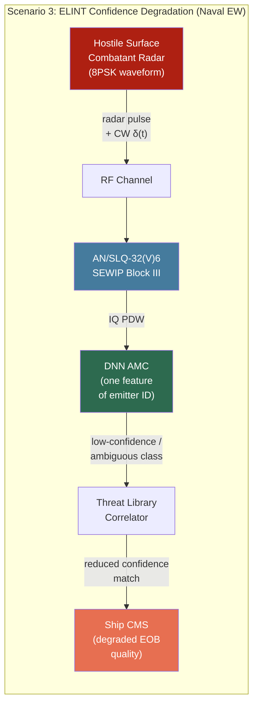
```mermaid
graph LR
    subgraph "Scenario 3: ELINT Confidence Degradation (Naval EW)"
        THREAT["Hostile Surface<br/>Combatant Radar<br/>(8PSK waveform)"] -->|"radar pulse<br/>+ CW δ(t)"| PROP["RF Channel"]
        PROP --> ESM["AN/SLQ-32(V)6<br/>SEWIP Block III"]
        ESM -->|"IQ PDW"| AMC3["DNN AMC<br/>(one feature<br/>of emitter ID)"]
        AMC3 -->|"low-confidence /<br/>ambiguous class"| LIB["Threat Library<br/>Correlator"]
        LIB -->|"reduced confidence<br/>match"| CMS["Ship CMS<br/>(degraded EOB<br/>quality)"]
    end

    style THREAT fill:#ae2012,color:#fff
    style ESM fill:#457b9d,color:#fff
    style AMC3 fill:#2d6a4f,color:#fff
    style CMS fill:#e76f51,color:#fff
```

#### Scenario 4: 5G O-RAN ML Control Loop Poisoning

In Open RAN deployments, the Near-RT RIC (Radio Intelligent Controller) hosts ML-based xApps for interference classification and spectrum sharing. AMC outputs or features can serve as inputs to ML-based control policies, making them a potential attack surface for control-plane manipulation. An adversary within range of the O-RU antennas injects CW perturbation to degrade the AMC feature quality, biasing interference characterization inputs to downstream RRM (Radio Resource Management) xApps and ultimately degrading policy decisions at the SMO.

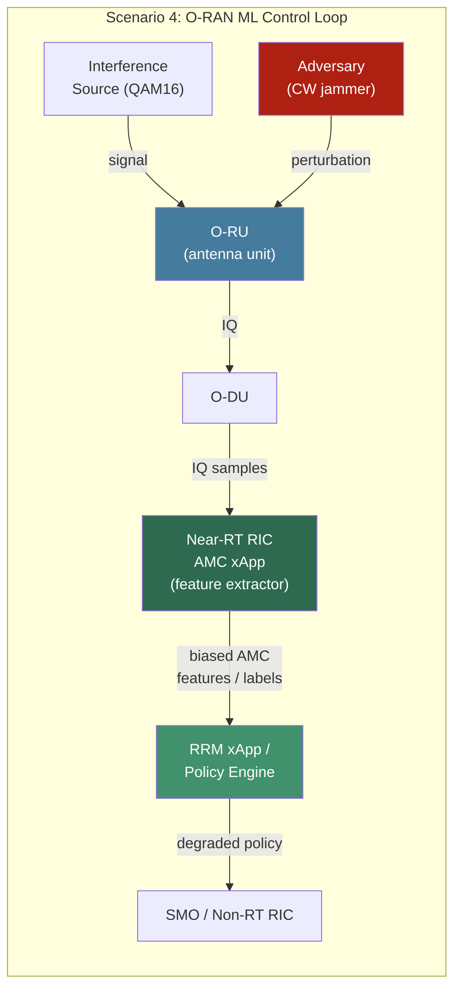
```mermaid
graph LR
    subgraph "Scenario 4: O-RAN ML Control Loop"
        INT["Interference<br/>Source (QAM16)"] -->|"signal"| ORU["O-RU<br/>(antenna unit)"]
        ADV4["Adversary<br/>(CW jammer)"] -->|"perturbation"| ORU
        ORU -->|"IQ"| ODU["O-DU"]
        ODU -->|"IQ samples"| RIC["Near-RT RIC<br/>AMC xApp<br/>(feature extractor)"]
        RIC -->|"biased AMC<br/>features / labels"| RRM["RRM xApp /<br/>Policy Engine"]
        RRM -->|"degraded policy"| SMO["SMO / Non-RT RIC"]
    end

    style ADV4 fill:#ae2012,color:#fff
    style ORU fill:#457b9d,color:#fff
    style RIC fill:#2d6a4f,color:#fff
    style RRM fill:#40916c,color:#fff
```

| Scenario | Real System | Adversary | Impact of Misclassification |
|----------|------------|-----------|----------------------------|
| **FCC enforcement evasion** | TCI 742 / R&S ARGUS monitoring station | Pirate operator or illegal repeater | Deprioritizes signal in automated triage; reduces likelihood of human inspection or escalation |
| **CBRS ESC/SAS bias** | Google/Federated SAS + ESC sensor (FCC Part 96) | Rogue CBSD or co-channel jammer | Biases signal characterization pipeline; increases probability of incorrect spectrum grant decisions |
| **ELINT confidence degradation** | AN/SLQ-32 SEWIP / CESM on naval platform | Hostile emitter with ECM capability | Degrades emitter identification confidence; may delay or distort downstream threat assessment |
| **O-RAN control loop poisoning** | Near-RT RIC with AMC xApp (O-RAN Alliance) | Nearby adversary with SDR | Biases AMC features/labels used by RRM xApps; degrades ML-driven control policy quality |

### 6. Attack Parameterization (Experimental)

The CW L2 attack is instantiated with parameters calibrated for IQ-domain signals:

| Parameter | Value | Rationale |
|-----------|-------|-----------|
| Normalization (`ta_box`) | `minmax` | Per-sample min-max to [0,1]; preserves relative signal dynamics |
| Confidence margin (`kappa`) | 1.0 | Forces misclassification with margin; increases attack transferability |
| L2 penalty weight (`c`) | 1.0 | Balances misclassification loss vs perturbation norm |
| Optimization steps | 100 | Sufficient convergence for 128-sample IQ bursts |
| Learning rate | 0.001 | Stable optimization in minmax-normalized space |

**Attack effectiveness**: Reduces overall AMC accuracy from 91.1% to 35.1% (61.5% relative degradation). Attack success varies by modulation: QAM64 drops to 0.6%, while CPFSK only drops to 86.1% -- confirming that higher-order constellation modulations are more vulnerable to L2-minimal perturbations.

## System Overview

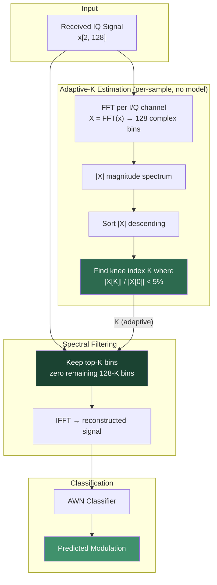
```mermaid
graph TB
    subgraph Input
        RX["Received IQ Signal<br/>x[2, 128]"]
    end

    subgraph Adaptive-K Estimation ["Adaptive-K Estimation (per-sample, no model)"]
        FFT["FFT per I/Q channel<br/>X = FFT(x) → 128 complex bins"]
        MAG["|X| magnitude spectrum"]
        SORT["Sort |X| descending"]
        KNEE["Find knee index K where<br/>|X[K]| / |X[0]| < 5%"]

        FFT --> MAG --> SORT --> KNEE
    end

    subgraph Spectral Filtering ["Spectral Filtering"]
        TOPK["Keep top-K bins<br/>zero remaining 128-K bins"]
        IFFT["IFFT → reconstructed signal"]
        TOPK --> IFFT
    end

    subgraph Classification
        AWN["AWN Classifier"]
        PRED["Predicted Modulation"]
        AWN --> PRED
    end

    RX --> FFT
    RX --> TOPK
    KNEE -- "K (adaptive)" --> TOPK
    IFFT --> AWN

    style KNEE fill:#2d6a4f,color:#fff
    style TOPK fill:#1b4332,color:#fff
    style PRED fill:#40916c,color:#fff
```

## Proposal: Defense Pipeline (Deployed in Real RF Systems)

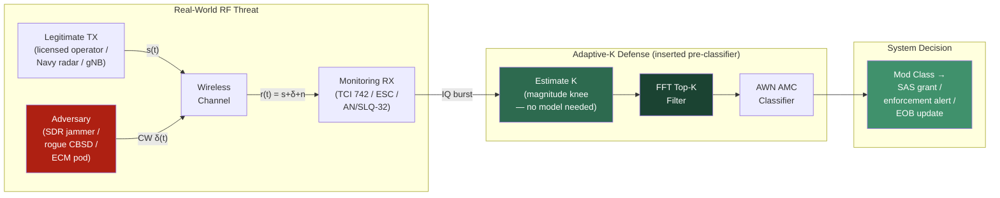
```mermaid
graph LR
    subgraph "Real-World RF Threat"
        TX["Legitimate TX<br/>(licensed operator /<br/>Navy radar / gNB)"] -->|"s(t)"| CH["Wireless<br/>Channel"]
        ATK["Adversary<br/>(SDR jammer /<br/>rogue CBSD /<br/>ECM pod)"] -->|"CW δ(t)"| CH
        CH -->|"r(t) = s+δ+n"| RX["Monitoring RX<br/>(TCI 742 / ESC /<br/>AN/SLQ-32)"]
    end

    subgraph "Adaptive-K Defense (inserted pre-classifier)"
        RX -->|"IQ burst"| EST["Estimate K<br/>(magnitude knee<br/>— no model needed)"]
        EST --> FILT["FFT Top-K<br/>Filter"]
        FILT --> CLF["AWN AMC<br/>Classifier"]
    end

    subgraph "System Decision"
        CLF --> DEC["Mod Class →<br/>SAS grant /<br/>enforcement alert /<br/>EOB update"]
    end

    style ATK fill:#ae2012,color:#fff
    style EST fill:#2d6a4f,color:#fff
    style FILT fill:#1b4332,color:#fff
    style DEC fill:#40916c,color:#fff
```

The adaptive-K defense is a lightweight signal-processing layer inserted between the RF front-end and the DNN classifier. It requires no model access, no retraining, and adds negligible latency (~0.1 ms per burst on GPU for FFT+filter+IFFT of 128-point signals). This makes it deployable as a firmware update to existing monitoring receivers, an ESC sensor preprocessing module, or a preprocessor xApp in O-RAN Near-RT RIC.

## How K Adapts Per Modulation

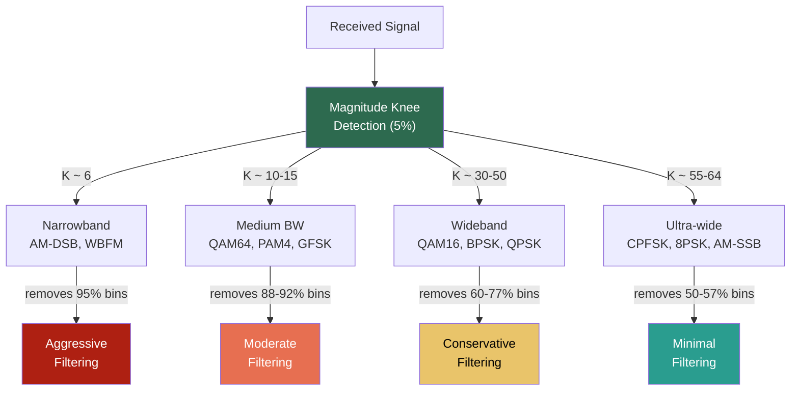
```mermaid
graph TD
    SIG["Received Signal"] --> KNEE["Magnitude Knee<br/>Detection (5%)"]

    KNEE -->|"K ~ 6"| NB["Narrowband<br/>AM-DSB, WBFM"]
    KNEE -->|"K ~ 10-15"| MB["Medium BW<br/>QAM64, PAM4, GFSK"]
    KNEE -->|"K ~ 30-50"| WB["Wideband<br/>QAM16, BPSK, QPSK"]
    KNEE -->|"K ~ 55-64"| UWB["Ultra-wide<br/>CPFSK, 8PSK, AM-SSB"]

    NB -->|"removes 95% bins"| AGG["Aggressive<br/>Filtering"]
    MB -->|"removes 88-92% bins"| MOD["Moderate<br/>Filtering"]
    WB -->|"removes 60-77% bins"| CON["Conservative<br/>Filtering"]
    UWB -->|"removes 50-57% bins"| MIN["Minimal<br/>Filtering"]

    style KNEE fill:#2d6a4f,color:#fff
    style AGG fill:#ae2012,color:#fff
    style MOD fill:#e76f51,color:#fff
    style CON fill:#e9c46a,color:#000
    style MIN fill:#2a9d8f,color:#fff
```

## Approach Comparison (58 tested)

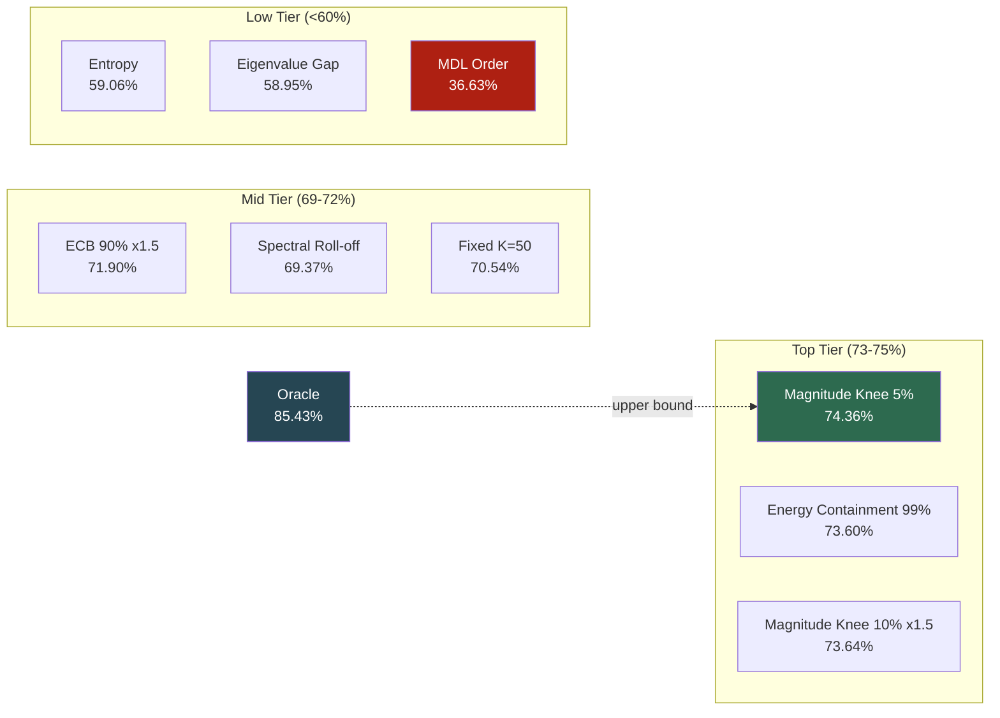
```mermaid
graph LR
    subgraph "Top Tier (73-75%)"
        A1["Magnitude Knee 5%<br/>74.36%"]
        A2["Energy Containment 99%<br/>73.60%"]
        A3["Magnitude Knee 10% x1.5<br/>73.64%"]
    end

    subgraph "Mid Tier (69-72%)"
        B1["ECB 90% x1.5<br/>71.90%"]
        B2["Spectral Roll-off<br/>69.37%"]
        B3["Fixed K=50<br/>70.54%"]
    end

    subgraph "Low Tier (<60%)"
        C1["Entropy<br/>59.06%"]
        C2["Eigenvalue Gap<br/>58.95%"]
        C3["MDL Order<br/>36.63%"]
    end

    ORACLE["Oracle<br/>85.43%"] -.->|"upper bound"| A1

    style A1 fill:#2d6a4f,color:#fff
    style ORACLE fill:#264653,color:#fff
    style C3 fill:#ae2012,color:#fff
```

## Method: Sorted Magnitude Knee (5% threshold)

For each received IQ signal `x[2, 128]`:

1. Compute full complex FFT per channel: `X = FFT(x)` → 128 bins
2. Sort `|X|` descending
3. Find smallest index `K` where `|X[K]| / |X[0]| < 0.05`
4. Keep top-K bins, zero the rest, IFFT back to time domain

This selects K **per-sample** based on how many frequency bins carry meaningful signal energy. Narrowband signals (QAM64, AM-DSB) get small K (aggressive filtering), wideband signals (BPSK, CPFSK) get large K (preserving bandwidth).

## Experimental Setup

| Parameter | Value |
|-----------|-------|
| Model | AWN (Adaptive Wavelet Network) |
| Dataset | RML2016.10a, test split |
| SNR range | >= 0 dB (10 SNR points, 22000 samples) |
| Attack | CW L2 (torchattacks), minmax box |
| CW params | c=1.0, kappa=1.0, steps=100, lr=0.001 |

## Results

| Condition | Overall Accuracy |
|-----------|-----------------|
| Clean (no attack) | 91.08% |
| CW attacked (no defense) | 35.12% |
| Best fixed K=50 | 70.54% |
| **Adaptive knee K (ours)** | **74.36%** |
| Oracle (per-sample best) | 85.43% |

### Per-Modulation Breakdown

| Modulation | Clean | CW | Adaptive K | Oracle | Avg K selected |
|------------|------:|----:|-----------:|-------:|---------------:|
| QAM64 | 91.9% | 0.6% | 76.5% | 98.6% | ~33 |
| PAM4 | 99.2% | 77.9% | 96.9% | 99.3% | ~37 |
| AM-DSB | 98.5% | 61.4% | 96.3% | 99.7% | ~6 |
| GFSK | 99.4% | 18.1% | 88.5% | 98.9% | ~34 |
| CPFSK | 100% | 86.1% | 94.4% | 96.7% | ~55 |
| BPSK | 98.6% | 73.6% | 85.3% | 89.0% | ~52 |
| QPSK | 98.1% | 39.5% | 83.7% | 90.4% | ~57 |
| QAM16 | 91.4% | 0.6% | 48.8% | 87.4% | ~36 |
| 8PSK | 96.9% | 2.4% | 39.9% | 59.3% | ~56 |
| AM-SSB | 90.5% | 3.5% | 74.9% | 79.2% | ~128 |
| WBFM | 37.6% | 26.0% | 32.9% | 41.5% | ~10 |

### Comparison: 58 approaches tested

Grouped by category with best variant per category:

| Category | Best Variant | Accuracy | Principle |
|----------|-------------|----------|-----------|
| **Magnitude knee** | knee_5pct_x1.0 | **74.36%** | Sorted mag elbow at 5% of peak |
| Energy containment | ecb_99_direct | 73.60% | Min bins for 99% energy |
| Spectral roll-off | rolloff_95_x0.5 | 69.37% | Cumulative energy from bin 0 |
| Spectral entropy | entropy_quantile | 59.06% | Shannon entropy of PSD |
| Eigenvalue gap | eiggap_x3.0 | 58.95% | Largest gap in sorted PSD |
| Spectral kurtosis | kurtosis_quantile | 58.60% | PSD peakedness |
| Spectral spread | spread_quantile | 56.04% | 2nd moment of PSD |
| Entropy threshold | ent3grp_5.2_6.0 | 44.55% | 3-group entropy binning |
| MDL model order | mdl_x5.0 | 36.63% | Information-theoretic order |

### Per-Modulation Recovery (CW, SNR >= 0, all K values)

| Mod | Clean | CW | K=2 | K=5 | K=8 | K=10 | K=15 | K=20 | K=30 | K=50 | K=64 | Best K |
|--------|------:|----:|----:|----:|----:|-----:|-----:|-----:|-----:|-----:|-----:|-------:|
| BPSK | 98.6% | 73.6% | 0.7% | 0.5% | 0.9% | 2.1% | 45.6% | 80.7% | 82.2% | 83.6% | 84.6% | K=64 |
| QPSK | 98.1% | 39.5% | 0.0% | 0.1% | 0.1% | 0.4% | 34.0% | 73.8% | 78.3% | 82.6% | 82.4% | K=50 |
| 8PSK | 96.9% | 2.4% | 0.8% | 1.0% | 1.0% | 1.0% | 5.6% | 36.5% | 32.6% | 36.8% | 40.5% | K=64 |
| QAM16 | 91.4% | 0.6% | 21.9% | 23.6% | 4.4% | 4.8% | 16.7% | 50.2% | 47.6% | 45.9% | 42.8% | K=20 |
| QAM64 | 91.9% | 0.6% | 5.3% | 68.0% | 92.9% | 94.3% | 89.4% | 83.7% | 75.0% | 65.2% | 53.8% | K=10 |
| PAM4 | 99.2% | 77.9% | 52.1% | 94.4% | 96.3% | 97.0% | 97.9% | 97.8% | 96.7% | 96.5% | 95.5% | K=15 |
| CPFSK | 100% | 86.1% | 0.1% | 0.6% | 1.9% | 8.9% | 78.5% | 88.7% | 92.6% | 94.4% | 94.7% | K=64 |
| GFSK | 99.4% | 18.1% | 22.1% | 36.2% | 59.4% | 76.2% | 91.3% | 88.9% | 84.1% | 79.4% | 74.5% | K=15 |
| AM-DSB | 98.5% | 61.4% | 98.4% | 93.8% | 92.4% | 92.6% | 92.7% | 92.1% | 92.1% | 91.0% | 89.8% | K=2 |
| AM-SSB | 90.5% | 3.5% | 0.0% | 0.0% | 0.0% | 0.0% | 0.0% | 0.3% | 16.1% | 67.2% | 74.9% | K=64 |
| WBFM | 37.6% | 26.0% | 18.6% | 34.9% | 37.6% | 37.8% | 37.2% | 36.4% | 34.7% | 33.7% | 33.8% | K=10 |
| **ALL** | **91.1%** | **35.1%** | 20.0% | 32.1% | 35.2% | 37.7% | 53.5% | 66.2% | 66.5% | **70.5%** | 69.6% | **K=50** |

### Per-SNR Per-Modulation Recovery (selected K values)

**SNR = 0 dB**

| Mod | Clean | CW | K=10 | K=15 | K=20 | K=50 | Best K |
|--------|------:|----:|-----:|-----:|-----:|-----:|-------:|
| QAM64 | 89.0% | 0.0% | 93.0% | 88.5% | 81.5% | 70.0% | K=10 |
| PAM4 | 99.5% | 56.0% | 92.0% | 94.5% | 94.0% | 92.0% | K=15 |
| GFSK | 95.0% | 43.0% | 73.0% | 79.5% | 79.0% | 84.0% | K=50 |
| AM-DSB | 92.5% | 15.0% | 78.0% | 80.0% | 82.5% | 81.0% | K=20 |
| BPSK | 99.5% | 27.0% | 1.0% | 6.5% | 30.5% | 49.5% | K=50 |
| QPSK | 94.0% | 0.5% | 0.0% | 0.5% | 3.0% | 48.0% | K=50 |

**SNR = 10 dB**

| Mod | Clean | CW | K=10 | K=15 | K=20 | K=50 | Best K |
|--------|------:|----:|-----:|-----:|-----:|-----:|-------:|
| QAM64 | 93.0% | 0.5% | 95.0% | 91.0% | 84.5% | 66.5% | K=10 |
| PAM4 | 99.0% | 81.5% | 97.5% | 98.5% | 99.0% | 98.5% | K=20 |
| GFSK | 100% | 15.0% | 79.5% | 97.0% | 94.5% | 77.5% | K=15 |
| AM-DSB | 100% | 83.5% | 98.5% | 97.5% | 97.0% | 95.0% | K=5 |
| BPSK | 98.5% | 83.0% | 2.5% | 55.0% | 90.5% | 89.0% | K=20 |
| QPSK | 99.0% | 51.0% | 0.5% | 41.5% | 90.5% | 93.0% | K=30 |

**SNR = 18 dB**

| Mod | Clean | CW | K=10 | K=15 | K=20 | K=50 | Best K |
|--------|------:|----:|-----:|-----:|-----:|-----:|-------:|
| QAM64 | 93.0% | 0.0% | 96.5% | 86.5% | 80.0% | 62.0% | K=10 |
| PAM4 | 99.5% | 78.5% | 98.5% | 99.5% | 99.0% | 97.0% | K=15 |
| GFSK | 100% | 26.5% | 78.5% | 96.0% | 95.0% | 77.5% | K=15 |
| AM-DSB | 100% | 100% | 100% | 100% | 100% | 100% | K=5 |
| BPSK | 98.0% | 82.5% | 1.0% | 53.0% | 87.5% | 89.5% | K=30 |
| QPSK | 98.5% | 59.5% | 0.5% | 46.5% | 92.5% | 90.0% | K=20 |

## Sorted FFT Magnitude Profiles

Sorted FFT magnitude curves reveal why each modulation requires a different K. Each plot shows `|FFT|` bins sorted descending (peak-normalized), with the 5% threshold line and knee point marked.

### All Modulations (Grid)

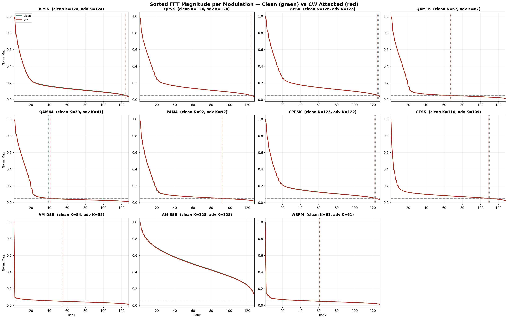

### All Modulations (Overlay)

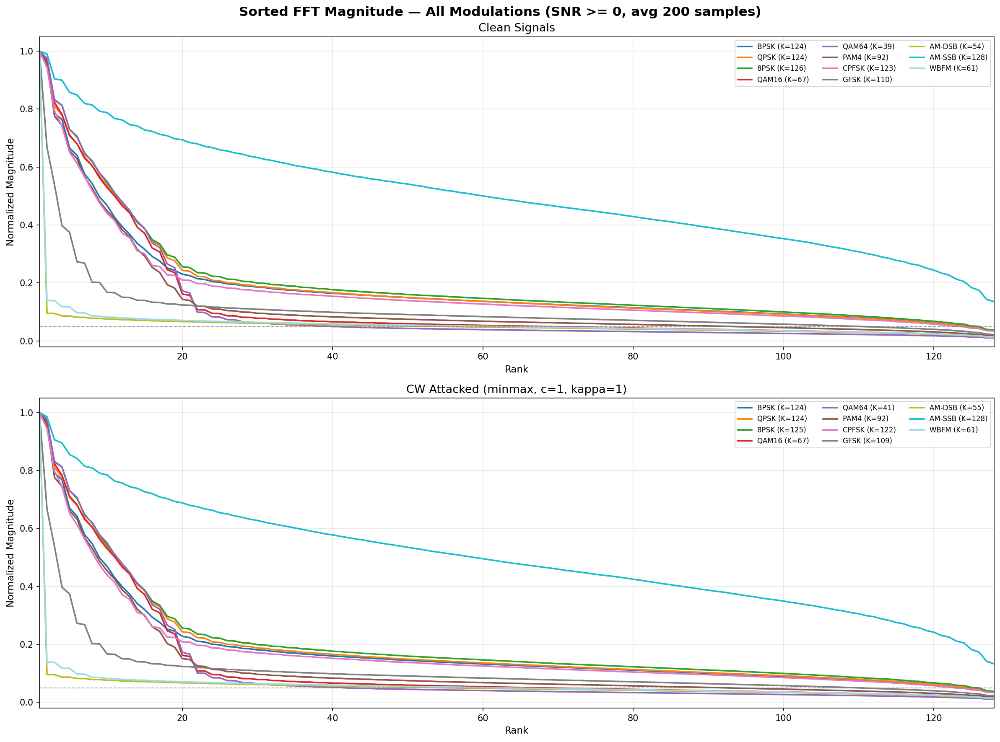

### Individual Modulations

#### Narrowband (small K optimal)

**AM-DSB** (best K=2) — Energy concentrated near DC, steepest drop of all modulations.

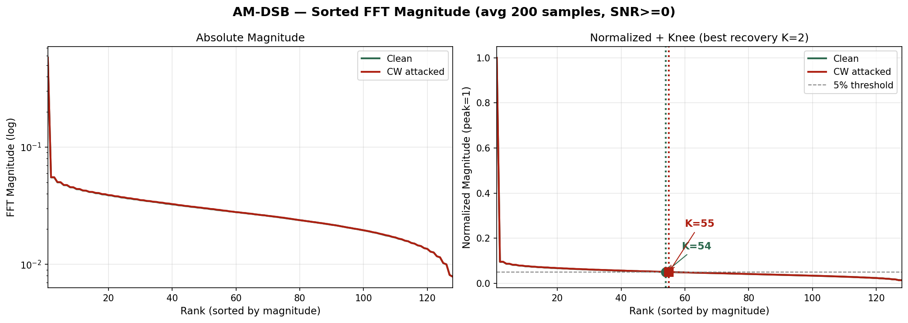

**QAM64** (best K=10) — Compact constellation with tight spectral support, sharp knee at rank ~39.

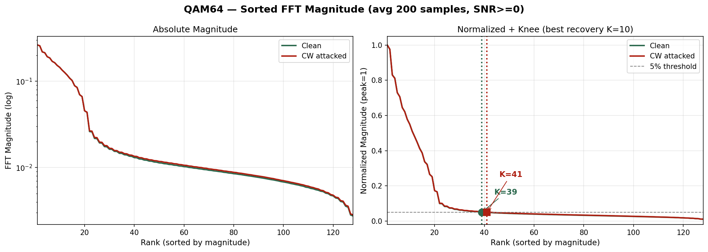

**WBFM** (best K=10) — Despite "wideband" name, FM energy concentrates in few dominant bins.

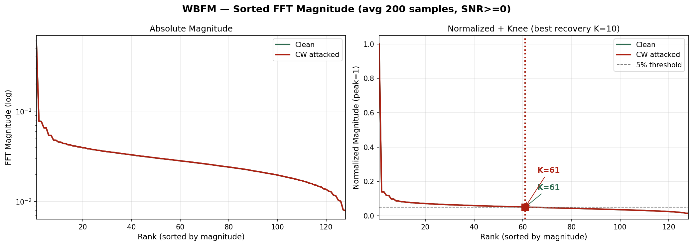

#### Medium bandwidth (K=15)

**PAM4** (best K=15) — Moderate spectral spread, gradual rolloff from rank 15 onward.

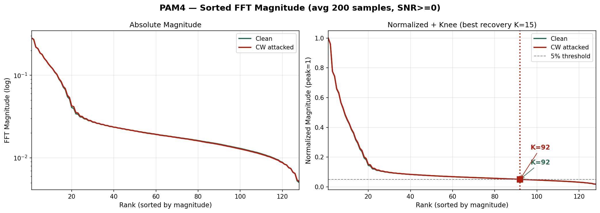

**GFSK** (best K=15) — Gaussian shaping limits bandwidth; energy drops after ~34 bins.

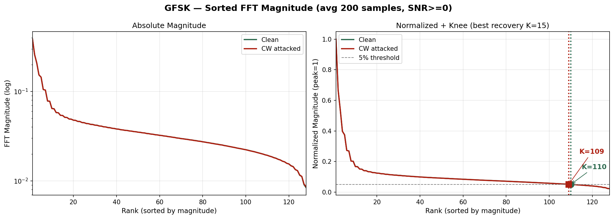

#### Medium-wide (K=20)

**QAM16** (best K=20) — Wider constellation than QAM64, knee at ~67, but best recovery at K=20 due to attack overlap.

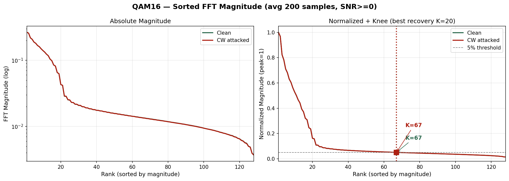

#### Wideband (large K optimal)

**BPSK** (best K=64) — Nearly flat sorted magnitude; energy spread across almost all 128 bins.

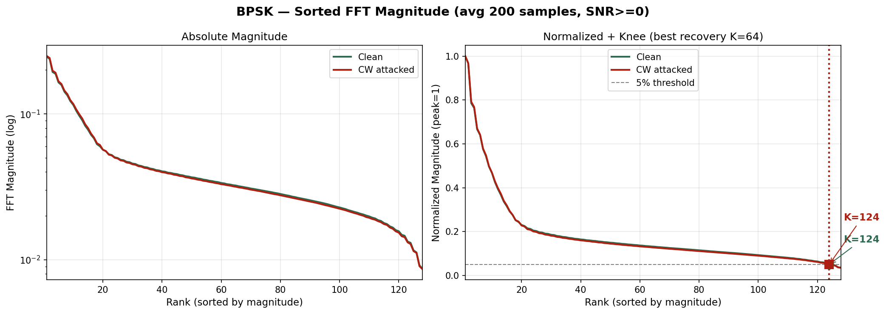

**QPSK** (best K=50) — Similar flat profile to BPSK.

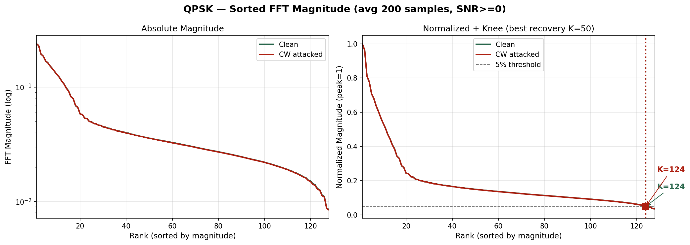

**8PSK** (best K=64) — Flat spectrum, hardest to recover (40.5%) because CW perturbation is indistinguishable from signal.

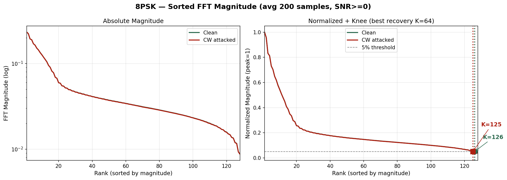

**CPFSK** (best K=64) — Continuous-phase FSK; energy spread across full band.

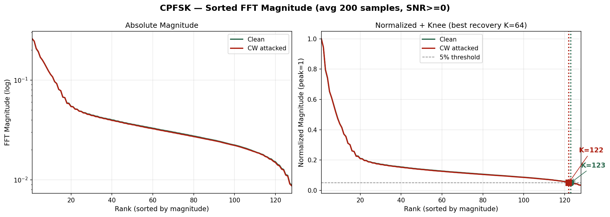

**AM-SSB** (best K=64) — Single sideband occupies half the spectrum; needs most bins preserved.

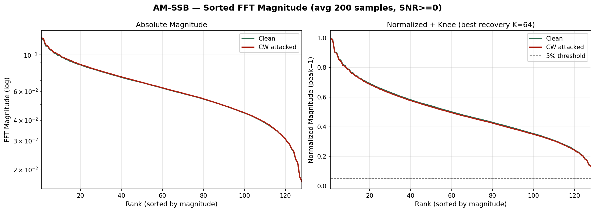

### Knee vs Best Recovery K

The 5% knee on the **averaged** sorted magnitude overestimates K because the CW attack raises the magnitude tail. The per-sample knee (used in the actual defense) has more variance and works better, but still overestimates:

| Mod | 5% Knee (avg) | Best Recovery K | Overestimate |
|--------|:---:|:---:|:---:|
| AM-DSB | 54 | 2 | 27x |
| QAM64 | 39 | 10 | 4x |
| WBFM | 61 | 10 | 6x |
| PAM4 | 92 | 15 | 6x |
| GFSK | 110 | 15 | 7x |
| QAM16 | 67 | 20 | 3x |
| QPSK | 124 | 50 | 2.5x |
| BPSK | 124 | 64 | 2x |
| 8PSK | 126 | 64 | 2x |
| CPFSK | 123 | 64 | 2x |
| AM-SSB | 128 | 64 | 2x |

This overestimation is the primary source of the 11pp gap to oracle. Future work: calibrate the threshold per spectral shape class, or use a learned mapping from knee to optimal K.

## Why It Works

CW attack adds perturbation energy across the spectrum, but the perturbation magnitude per-bin is small relative to the signal's dominant spectral peaks. The 5% magnitude knee detects exactly where signal energy ends and attack+noise begins. By zeroing bins below 5% of the peak, we remove most of the adversarial perturbation while preserving the signal's spectral structure.

The method adapts naturally to each modulation's bandwidth:
- AM-DSB concentrates energy near DC → K ~ 6 → removes 95% of bins (aggressive)
- BPSK spreads energy across many bins → K ~ 52 → keeps 41% of bins (conservative)

## Limitations

- **8PSK and QAM16** remain hard to recover (40-49%) because CW perturbation overlaps with signal bins at similar magnitudes
- **11pp gap to oracle** — some samples need a K that doesn't match their knee point
- Threshold of 5% is empirically chosen; may need tuning for different attack strengths

## Implementation

```python
def sorted_magnitude_knee(x, ratio_thresh=0.05):
    """x: [N, 2, T] IQ signal → K per sample [N]"""
    psd = torch.fft.fft(x, dim=2).abs() ** 2  # [N, 2, T]
    psd = psd.mean(dim=1)                       # avg I/Q → [N, T]
    sorted_mag, _ = psd.sqrt().sort(dim=1, descending=True)
    peak = sorted_mag[:, 0:1].clamp(min=1e-12)
    ratio = sorted_mag / peak
    below = ratio < ratio_thresh
    knee = below.float().argmax(dim=1).clamp(min=1)
    knee[~below.any(dim=1)] = psd.shape[1]
    return knee  # [N] per-sample K

def adaptive_topk_defense(x, model=None):
    K = sorted_magnitude_knee(x, ratio_thresh=0.05)
    result = x.clone()
    for k in K.unique():
        mask = (K == k)
        X = torch.fft.fft(x[mask], dim=2)
        mags = X.abs()
        _, idx = mags.topk(k=int(k), dim=2)
        filt = torch.zeros_like(X)
        filt.scatter_(2, idx, X.gather(2, idx))
        result[mask] = torch.fft.ifft(filt, dim=2).real
    return result
```

No model access required — purely signal-processing based.
