# 自適應-K FFT 防禦用於 CW 攻擊恢復

## 威脅模型

### 1. 受保護系統

部署於射頻頻譜管理系統中的**基於深度神經網路的自動調變分類（AMC）**接收機。以下三個真實世界部署情境為本研究提供動機：

#### 1a. ITU/FCC 頻譜監測站

國家監管機構（FCC 執法局、ITU 區域監測站、英國 Ofcom）部署自動化監測站以偵測未授權傳輸並分類信號類型以供執法使用。R&S ARGUS 或 TCI 740 系列接收機將寬頻射頻數位化，並將 IQ 資料饋入分類引擎。

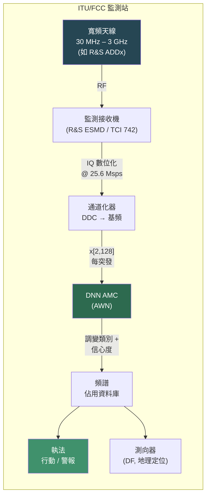

#### 1b. CBRS SAS / ESC（FCC Part 96）

3.5 GHz 公民寬頻無線電服務（CBRS）使用環境感知能力（ESC）來偵測既有海軍雷達並重新導向商業用戶。SAS（頻譜存取系統）營運商如 Google、Federated Wireless 和 CommScope 依賴 AMC 在 3550–3700 MHz 頻段區分 LTE-TDD、脈衝雷達和業餘信號。

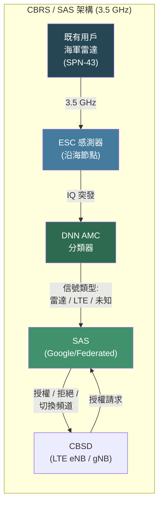

#### 1c. 軍用 ESM / ELINT 接收機

艦載電子支援措施（ESM）系統（AN/SLQ-32、哈利法克斯級護衛艦上的 CESM）和空中平台（AN/ALQ-218）執行即時調變分類以識別輻射源類型並建立電子戰鬥序列（EOB）。現代 ESM 以基於 DNN 的 AMC 取代查表式分類器，用於識別新型波形。

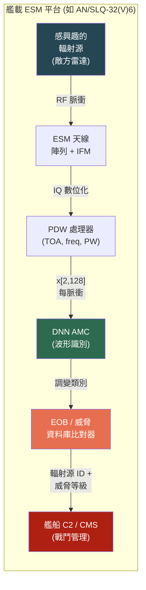

| 元件 | 規格 |
|-----------|--------------|
| 信號格式 | 複數基頻 IQ，2 通道 x 128 取樣 |
| 調變類別 | 11 種（BPSK、QPSK、8PSK、QAM16、QAM64、PAM4、CPFSK、GFSK、AM-DSB、AM-SSB、WBFM） |
| 操作 SNR | 0 -- 18 dB（現場實際範圍） |
| 分類器 | AWN（自適應小波網路），SNR >= 0 時乾淨準確率 91.1% |
| 部署情境 | ITU/FCC 監測、CBRS ESC/SAS、軍用 ESM/ELINT |
| 共同特性 | 非合作式監測——不與發射機協調 |

### 2. 對手模型

#### 2.1 對手目標

**主要目標**：使 AMC 錯誤分類接收信號（非定向逃避）。次要目標是保持隱蔽——擾動應難以被接收端的能量式或頻譜異常偵測器發現。

| 目標 | 描述 |
|-----------|-------------|
| 非定向誤分類 | 任何錯誤的類別預測都會降低監測系統效能 |
| 低可偵測性 | 擾動不應觸發傳統射頻異常偵測器 |
| 持續性 | 攻擊在多種 SNR 條件和調變類型下均能成功 |

#### 2.2 對手知識（白盒）

我們在**最強對手假設**下進行評估，以建立最壞情況的防禦基線：

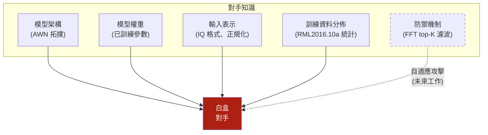

| 知識 | 程度 | 理由 |
|-----------|-------|---------------|
| 模型架構 | 完全 | 假設逆向工程或內部人員存取 |
| 模型權重 | 完全 | 最壞情況；支援基於梯度的攻擊 |
| 輸入正規化 | 完全 | IQ 範圍、minmax 映射已知 |
| 防禦機制 | 未知 | 防禦者部署頻譜濾波但未公開 |
| 真實信號內容 | 無 | 對手不知道每個突發的合法波形 |

#### 2.3 對手能力

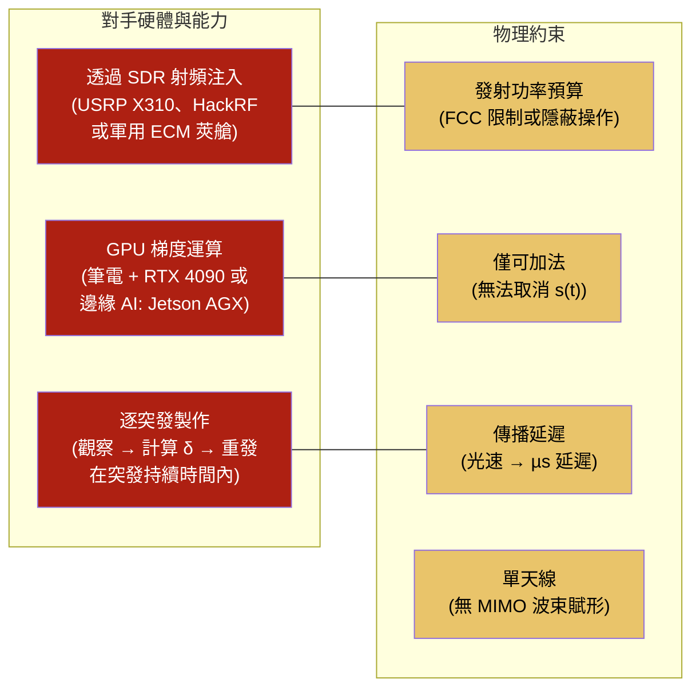

| 能力 | 細節 | 真實世界對應 |
|------------|--------|---------------------|
| **注入方法** | 加法空中傳輸：對手在與合法信號相同頻率上傳輸 `delta(t)`。接收機觀察到 `r(t) = s(t) + delta(t) + n(t)`。 | SDR 干擾器（USRP B210/X310 搭配 GNURadio）、軍用 ECM 莢艙（AN/ALQ-99）、或修改韌體的惡意 CBSD |
| **最佳化** | CW L2 攻擊（Carlini & Wagner），具完全梯度存取。在誤分類約束下最小化 `\|\|delta\|\|_2`，含信心餘量 kappa。 | 邊緣 AI 運算（NVIDIA Jetson AGX、筆電 GPU）與 TX 共置——對 128 取樣突發可行，約 10 ms/突發 |
| **逐突發製作** | 對手為每個觀察到的突發計算獨特擾動（最強攻擊；較弱的通用擾動是其子集）。 | 全雙工 SDR（獨立 RX/TX 鏈路）攔截突發、計算擾動、重新傳輸。戰術場景需 < 1 ms 延遲 |
| **功率預算** | 擾動範數由 CW 的 L2 最小化目標隱式約束（c=1.0, kappa=1.0）。典型擾動功率比信號功率低 10-20 dB。 | 低功率注入：相對信號 -20 dBc ≈ 若信號為 1 mW 則 10 µW——在 SDR TX 範圍內且低於能量偵測閾值 |
| **時序** | 反應式——對手攔截信號、計算擾動、在突發持續時間內重發。假設有足夠的運算能力進行即時 CW 最佳化。 | 儲存轉發：將突發捕獲至 FPGA 緩衝器，GPU 計算 δ，DAC 重新傳輸。可用 USRP X310 + GPU 管線實現 |

#### 2.4 對手限制

| 約束 | 影響 |
|------------|--------|
| 僅加法注入 | 無法取消或替換信號成分；合法信號能量持續存在於接收波形中 |
| 無通道知識 | 擾動經過未知通道 `h(t)` 可能扭曲攻擊 |
| L2 最小化 | CW 固有地最小化擾動範數，限制每頻帶能量——這是頻譜濾波利用的根本弱點 |
| 因果處理 | 即時延遲約束限制攻擊最佳化預算（步數、迭代次數） |

#### 2.5 為何選擇 L2 最小（CW）攻擊 — 接收機管線約束

一個自然的問題是：*為什麼對手要選擇 L2 最小攻擊如 CW，而不是直接發射大功率干擾？* 答案在於 AMC 分類器前方的多階段接收機管線。真實的射頻監測系統透過前端處理階段對接收信號統計施加隱式約束。這些階段本身並非安全機制，但它們建構了一個環境，使得高能量或頻譜集中的擾動更容易在到達 DNN 之前被偵測、標記或扭曲。

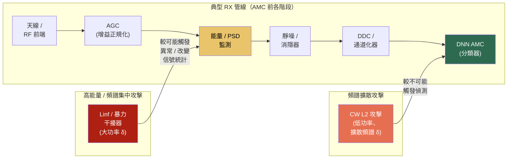

**前端階段及其對對抗性擾動的影響：**

| 階段 | 主要功能 | 對高能量/集中攻擊的影響 |
|-------|----------|----------------------------------------------|
| **AGC（自動增益控制）** | 將接收功率維持在 ADC 動態範圍內 | **不會**拒絕信號——但增益降低會壓縮擾動對信號的比率。使 ADC 飽和的大 δ 會觸發 AGC 縮放，削弱擾動的相對效果。AGC 不是防禦，但它施加了隱式功率約束。 |
| **能量 / PSD 監測** | 記錄或標記偏離預期頻段功率分佈的情況 | 高能量擾動提高總功率或每通道 PSD。取決於系統設計，這可能觸發異常標記、記錄條目或操作員警報——但不一定是硬拒絕。 |
| **靜噪 / 消隱器** | 閘控能量異常的時段（常見於雷達/ESM） | 脈衝式或突發性高能量干擾可能被消隱。持續低位準擾動通常可通過。 |
| **CFAR 偵測器**（雷達/ESM） | 用於目標擷取的自適應閾值偵測 | 高能量注入導致的噪底提升可扭曲 CFAR 閾值，可能觸發警報。低位準擾動維持在自適應閾值餘量之內。 |

> **重要說明。** 這些階段不構成安全邊界。許多運作中的系統不會硬拒絕異常信號，而是記錄、降低優先級、或附加元資料標記後傳遞。此論述是機率性的：高能量擾動在這些階段*更可能*觸發某種形式的偵測或扭曲，而頻譜擴散擾動*較不可能*觸發。

**為何 CW L2 較不容易觸發偵測——「頻譜擴散」特性：**

關鍵不僅是「低能量」，而是擾動的**頻譜剖面**。CW L2 最小化 `||δ||_2`，在頻域有特定的結果：擾動能量薄薄地分散在許多 FFT 頻帶，類似噪底的微幅提升，而非局部頻譜異常。

| 攻擊類型 | 頻譜剖面 | 偵測可能性 |
|-------------|-----------------|---------------------|
| **Linf（FGSM、PGD）** | 頻譜集中——擾動受每取樣限制，產生脈衝式或窄帶特徵 | 較高——頻譜尖峰或功率偏差更可能觸發 PSD 監測或 CFAR |
| **L2 最小（CW、DeepFool、EAD）** | 頻譜擴散——總能量被最小化，擾動薄薄地分散在時間和頻率上 | 較低——類似通道雜訊提升；沒有個別頻帶顯示可疑尖峰 |

具體而言，使用典型參數（c=1.0, kappa=1.0）的 CW：

1. **AGC 不受影響** — 擾動增加的功率可忽略（~-20 dBc），因此增益設定維持不變，擾動對信號比率被保留
2. **PSD 監測不太可能標記** — 每頻帶擾動能量與熱雜訊底變化相當，不是明顯的頻譜異常
3. **擾動類似通道雜訊** — 頻譜擴散且低幅度，難以與正常傳播引起的失真（多徑、衰落、干擾餘量）區分
4. **但它移動了 DNN 決策邊界** — DNN 對結構化擾動敏感，即使振幅低於噪底，因為擾動沿模型梯度方向最佳化

這造成了支撐我們威脅模型的根本不對稱性：

> 高能量或頻譜集中的攻擊（FGSM、PGD 配合大 ε）對單獨的 DNN 有效，但更可能被傳統射頻前端處理偵測或扭曲。L2 約束攻擊（CW、DeepFool、EAD）是**頻譜擴散的**——其低幅度、擴散頻譜的特性使其在各個管線階段較不可能觸發偵測，使其能以更高機率存活到 AMC 分類器。

這正是我們的防禦聚焦 CW 類攻擊的原因，也是防禦機制（頻譜濾波）利用同一特性的原因——使 CW 隱蔽的特性同時也是其弱點：擾動是頻譜擴散的，因此僅保留 top-K 幅度頻帶可丟棄大部分攻擊能量同時保留信號的主要頻譜結構。

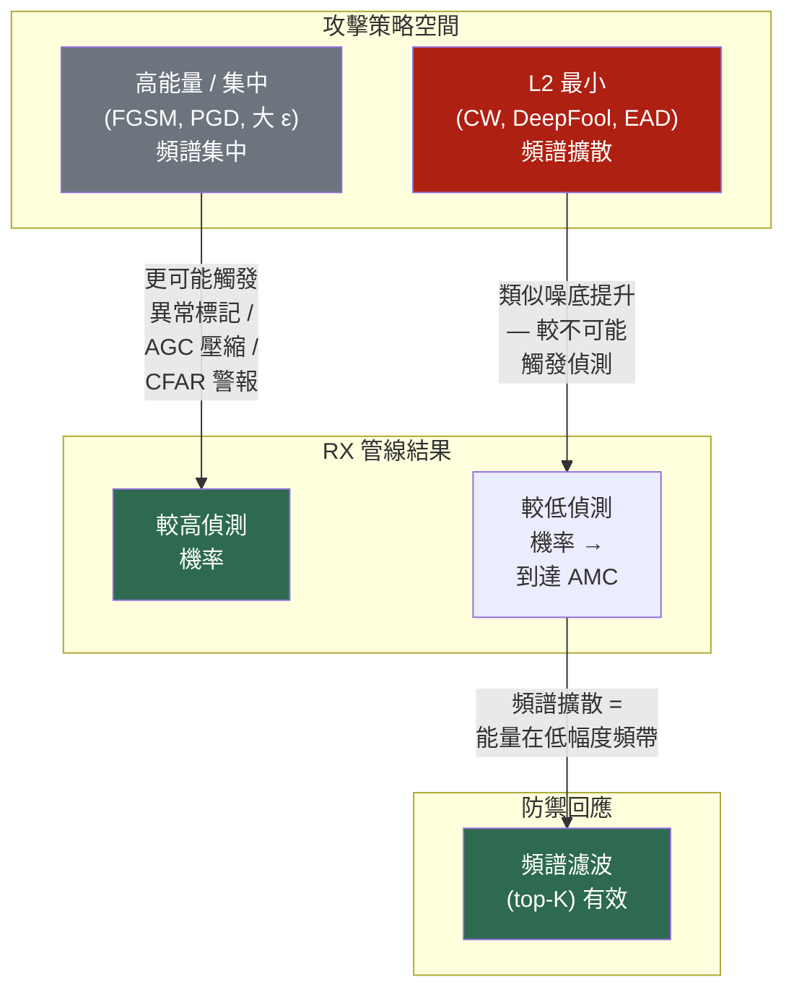

> **範圍限制。** 我們的實驗在基頻（DDC 後的 IQ 取樣）操作，不包含具有 AGC、CFAR 或能量偵測的完整射頻前端模擬。上述論述是 L2 最小攻擊為何是 AMC 系統最相關威脅類別的設計理由，而非在各管線階段偵測機率的經驗測量。在真實前端處理下驗證偵測率是重要的未來工作。

### 3. 攻擊面

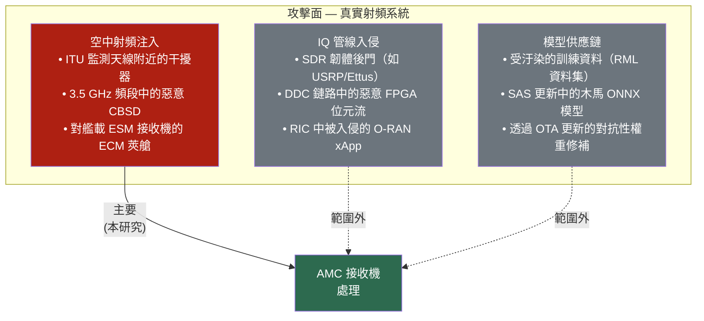

本研究僅處理**空中對抗性擾動**（AS1）——物理上真實的場景，即對手與發射機共置或操作附近的干擾器，將精心製作的擾動注入無線通道。這直接對應到：
- **頻譜監測**：在 FCC 監測天線附近操作的未授權發射機添加對抗性疊加以逃避分類
- **CBRS**：3.5 GHz 頻段中的惡意 CBSD 或干擾源混淆 ESC 感測器對既有雷達與 LTE 的分類
- **軍用 ESM**：電子反制措施（ECM）系統傳輸對抗性擾動以阻止 AN/SLQ-32 的調變識別

數位域攻擊（AS2：透過被入侵的 SDR 韌體或 O-RAN xApp 的 IQ 緩衝注入）和供應鏈攻擊（AS3：受汙染的模型權重）不在範圍內。

### 4. 防禦模型

#### 4.1 防禦者知識與假設

| 假設 | 理由 |
|------------|-----------|
| 無對手合作 | 防禦者無法查詢或探測對手 |
| 無乾淨參考 | 防禦者沒有配對的乾淨信號可供比較 |
| 僅信號處理 | 防禦不需要模型推論來估算 K（避免對抗性回饋迴路） |
| 調變無關 | 防禦對所有底層調變類型的操作完全相同 |
| 因果且即時 | 防禦逐突發執行，無預看或跨突發記憶 |

#### 4.2 防禦機制

頻譜幅度膝點偵測後接 FFT top-K 濾波：

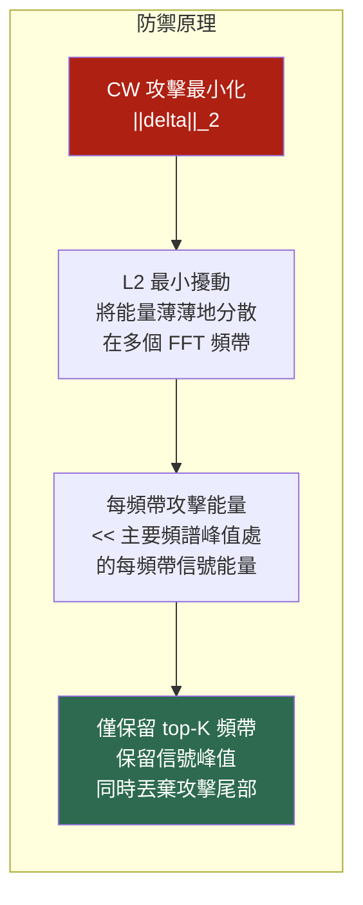

**核心洞察**：CW L2 最小化總擾動能量，這迫使對手將其功率預算分散到許多頻帶。在每個頻帶上，攻擊貢獻相對於合法信號的主要頻譜峰值很小。幅度膝點識別信號能量轉變為攻擊+雜訊能量的位置，top-K 濾波移除該邊界以下的所有內容。

#### 4.3 安全性質

| 性質 | 狀態 | 備註 |
|----------|--------|------|
| 無模型依賴 | 是 | K 僅從信號頻譜估算 |
| 優雅降級 | 是 | 若無攻擊存在，防禦保留 70-91% 乾淨準確率（取決於 K） |
| 攻擊無關 | 部分 | 針對 L2 最小攻擊調整（CW、DeepFool、EAD）；Linf 攻擊（FGSM、PGD）有不同頻譜特徵 |
| 自適應攻擊抵抗 | 開放 | 若對手知道防禦，可將擾動集中到 top-K 頻帶（未來工作） |

### 5. 威脅場景

> **定位說明。** 在所有場景中，AMC 作為*上游感知模組*，其輸出影響下游的自動化或人在迴路中的決策。對抗性 AMC 攻擊並非直接導致系統故障，而是透過微妙地偏置控制平面感知，導致下游管線中的決策品質降低或延遲。真實世界系統是多階段的：AMC 是多個決策信號之一（能量偵測、測向、協議解碼、人工審查）。威脅不在於 AMC 單獨決定結果，而在於此階段的誤分類可以壓制警報、降低信號優先級、或偏置後續分析。

#### 場景 1：FCC/ITU 頻譜執法逃避

未授權營運商（如地下 FM 廣播、非法 LTE 中繼器）在其傳輸中添加對抗性疊加。許多監測系統依賴自動分類管線來為人工或規則式分析排序信號優先級。AMC 階段的誤分類可以壓制下游警報或在自動監測工作流程中降低信號優先級——例如 QAM64 LTE 被標記為良性 WBFM，降低了觸發進一步檢查或由執法局升級處理的可能性。

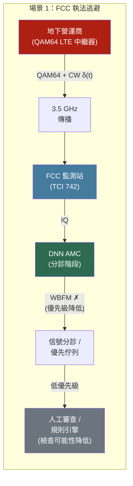

#### 場景 2：CBRS 頻段既有用戶偵測偏置

3550–3700 MHz CBRS 頻段中的惡意或故障 CBSD 傳輸對抗性擾動，偏置 ESC 感測器的信號特徵化管線。AMC 與能量偵測和脈衝描述分析一同為 ESC 系統的信號特徵化提供貢獻。誤分類可能偏置信號解讀管線，潛在影響頻譜存取決策——若既有雷達特徵被錯誤描述，將增加 SAS 授予應被拒絕存取的機率。

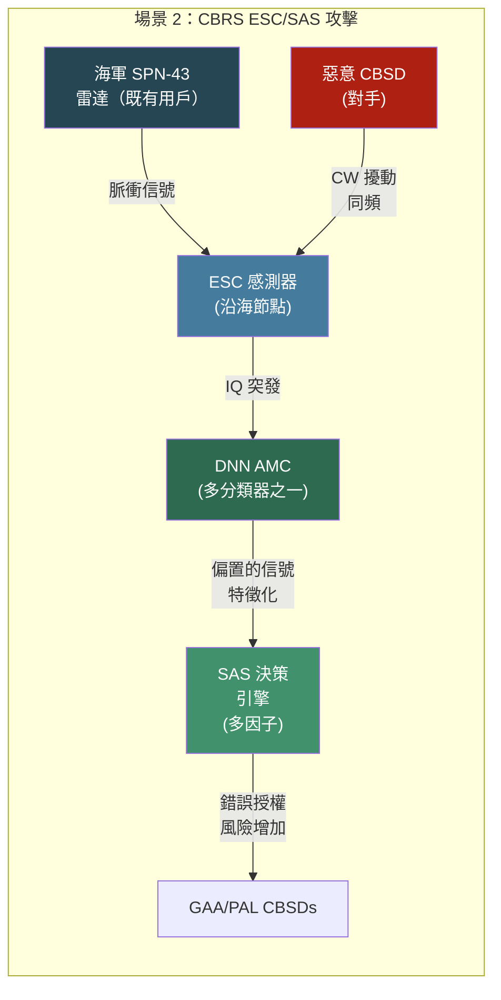

#### 場景 3：電子戰 — ELINT 信心度降級

敵方輻射源使用 ECM 技術在其雷達波形中添加對抗性擾動。防禦艦艇的 ESM 系統（AN/SLQ-32(V)6 SEWIP Block III）使用調變/波形分類作為輻射源識別的多個特徵之一。誤分類降低輻射源識別的信心度，並可能延遲或扭曲下游威脅評估——威脅資料庫比對器接收到較低信心度或模糊的匹配結果，降低了呈現給戰鬥管理系統的電子戰鬥序列（EOB）品質。

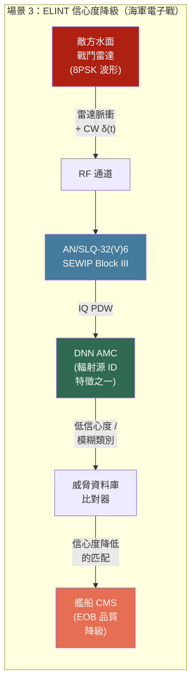

#### 場景 4：5G O-RAN ML 控制迴路毒化

在開放式 RAN 部署中，近即時 RIC（無線電智慧控制器）承載基於 ML 的 xApp 用於干擾分類和頻譜共享。AMC 的輸出或特徵可作為基於 ML 的控制策略的輸入，使其成為控制平面操縱的潛在攻擊面。在 O-RU 天線範圍內的對手注入 CW 擾動以降低 AMC 特徵品質，偏置下游 RRM（無線資源管理）xApp 的干擾特徵化輸入，最終降低 SMO 的策略決策品質。

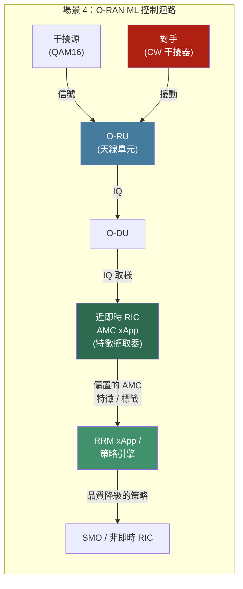

| 場景 | 真實系統 | 對手 | 誤分類的影響 |
|----------|------------|-----------|----------------------------|
| **FCC 執法逃避** | TCI 742 / R&S ARGUS 監測站 | 地下營運商或非法中繼器 | 在自動分診中降低信號優先級；降低人工檢查或升級處理的可能性 |
| **CBRS ESC/SAS 偏置** | Google/Federated SAS + ESC 感測器（FCC Part 96） | 惡意 CBSD 或同頻干擾器 | 偏置信號特徵化管線；增加錯誤頻譜授權決策的機率 |
| **ELINT 信心度降級** | AN/SLQ-32 SEWIP / 艦載 CESM | 具 ECM 能力的敵方輻射源 | 降低輻射源識別信心度；可能延遲或扭曲下游威脅評估 |
| **O-RAN 控制迴路毒化** | 具 AMC xApp 的近即時 RIC（O-RAN 聯盟） | 附近具 SDR 的對手 | 偏置 RRM xApp 使用的 AMC 特徵/標籤；降低 ML 驅動控制策略的品質 |

### 6. 攻擊參數化（實驗）

CW L2 攻擊使用針對 IQ 域信號校準的參數實例化：

| 參數 | 值 | 理由 |
|-----------|-------|-----------|
| 正規化 (`ta_box`) | `minmax` | 逐取樣 min-max 到 [0,1]；保留相對信號動態 |
| 信心餘量 (`kappa`) | 1.0 | 強制帶餘量的誤分類；增加攻擊可轉移性 |
| L2 懲罰權重 (`c`) | 1.0 | 平衡誤分類損失與擾動範數 |
| 最佳化步數 | 100 | 對 128 取樣 IQ 突發足夠收斂 |
| 學習率 | 0.001 | 在 minmax 正規化空間中穩定最佳化 |

**攻擊效果**：將整體 AMC 準確率從 91.1% 降低到 35.1%（61.5% 相對降級）。攻擊成功率因調變而異：QAM64 降至 0.6%，而 CPFSK 僅降至 86.1%——證實高階星座調變更容易受到 L2 最小擾動的影響。

## 系統概覽

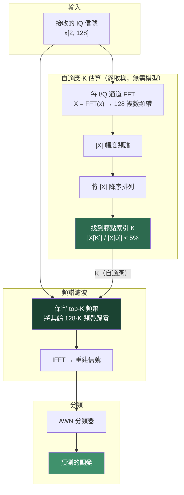

## 提案：防禦管線（部署於真實射頻系統）

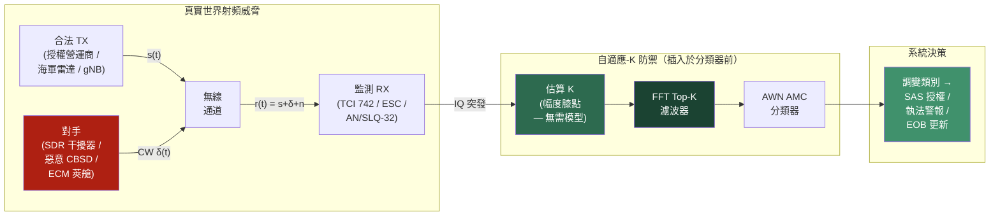

自適應-K 防禦是插入在射頻前端與 DNN 分類器之間的輕量信號處理層。它不需要模型存取、不需要重新訓練，且增加的延遲可忽略不計（GPU 上對 128 點信號的 FFT+濾波+IFFT 約 0.1 ms 每突發）。這使其可作為現有監測接收機的韌體更新、ESC 感測器的前處理模組、或 O-RAN 近即時 RIC 中的前處理 xApp 進行部署。

## K 如何自適應各調變

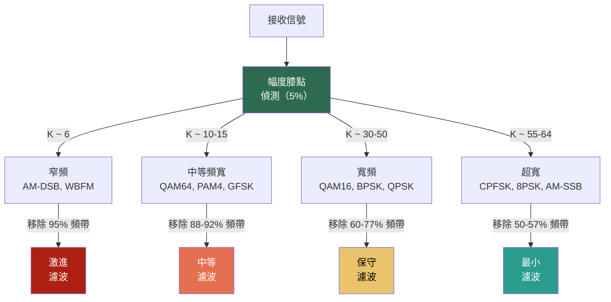

## 方法比較（已測試 58 種）

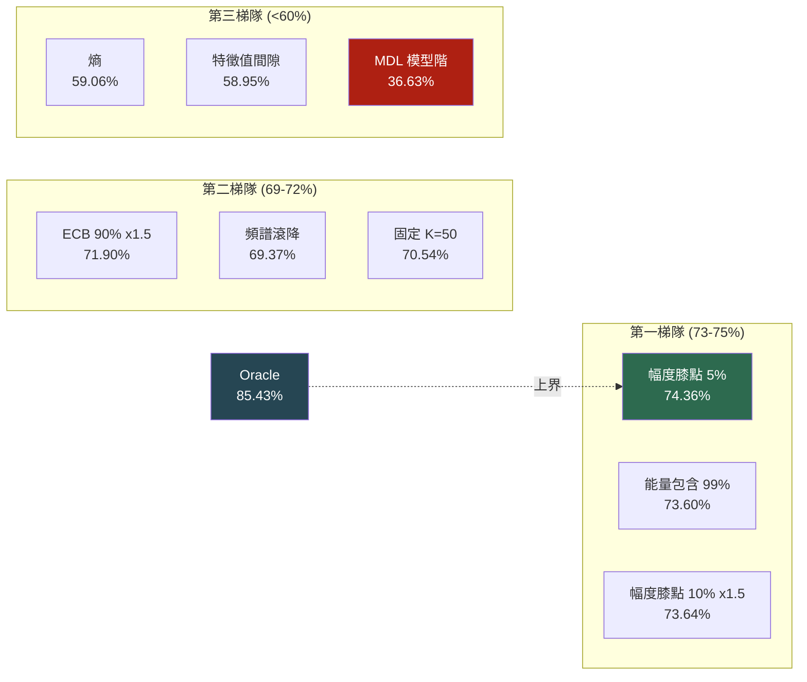

## 方法：排序幅度膝點（5% 閾值）

對每個接收的 IQ 信號 `x[2, 128]`：

1. 計算每通道的完整複數 FFT：`X = FFT(x)` → 128 頻帶
2. 將 `|X|` 降序排列
3. 找到最小索引 `K` 使得 `|X[K]| / |X[0]| < 0.05`
4. 保留 top-K 頻帶，其餘歸零，IFFT 回到時域

這根據有多少頻帶承載有意義的信號能量來**逐取樣**選擇 K。窄頻信號（QAM64、AM-DSB）得到小 K（激進濾波），寬頻信號（BPSK、CPFSK）得到大 K（保留頻寬）。

## 實驗設定

| 參數 | 值 |
|-----------|-------|
| 模型 | AWN（自適應小波網路） |
| 資料集 | RML2016.10a，測試分割 |
| SNR 範圍 | >= 0 dB（10 個 SNR 點，22000 個取樣） |
| 攻擊 | CW L2（torchattacks），minmax 盒 |
| CW 參數 | c=1.0, kappa=1.0, steps=100, lr=0.001 |

## 結果

| 條件 | 整體準確率 |
|-----------|-----------------|
| 乾淨（無攻擊） | 91.08% |
| CW 攻擊（無防禦） | 35.12% |
| 最佳固定 K=50 | 70.54% |
| **自適應膝點 K（本方法）** | **74.36%** |
| Oracle（逐取樣最佳） | 85.43% |

### 各調變細項

| 調變 | 乾淨 | CW | 自適應 K | Oracle | 平均選擇的 K |
|------------|------:|----:|-----------:|-------:|---------------:|
| QAM64 | 91.9% | 0.6% | 76.5% | 98.6% | ~33 |
| PAM4 | 99.2% | 77.9% | 96.9% | 99.3% | ~37 |
| AM-DSB | 98.5% | 61.4% | 96.3% | 99.7% | ~6 |
| GFSK | 99.4% | 18.1% | 88.5% | 98.9% | ~34 |
| CPFSK | 100% | 86.1% | 94.4% | 96.7% | ~55 |
| BPSK | 98.6% | 73.6% | 85.3% | 89.0% | ~52 |
| QPSK | 98.1% | 39.5% | 83.7% | 90.4% | ~57 |
| QAM16 | 91.4% | 0.6% | 48.8% | 87.4% | ~36 |
| 8PSK | 96.9% | 2.4% | 39.9% | 59.3% | ~56 |
| AM-SSB | 90.5% | 3.5% | 74.9% | 79.2% | ~128 |
| WBFM | 37.6% | 26.0% | 32.9% | 41.5% | ~10 |

### 比較：已測試 58 種方法

按類別分組，每類別最佳變體：

| 類別 | 最佳變體 | 準確率 | 原理 |
|----------|-------------|----------|-----------|
| **幅度膝點** | knee_5pct_x1.0 | **74.36%** | 排序幅度在峰值 5% 處的拐點 |
| 能量包含 | ecb_99_direct | 73.60% | 包含 99% 能量的最少頻帶 |
| 頻譜滾降 | rolloff_95_x0.5 | 69.37% | 從頻帶 0 開始的累積能量 |
| 頻譜熵 | entropy_quantile | 59.06% | PSD 的 Shannon 熵 |
| 特徵值間隙 | eiggap_x3.0 | 58.95% | 排序 PSD 中的最大間隙 |
| 頻譜峰度 | kurtosis_quantile | 58.60% | PSD 尖銳程度 |
| 頻譜展度 | spread_quantile | 56.04% | PSD 的二階矩 |
| 熵閾值 | ent3grp_5.2_6.0 | 44.55% | 3 組熵分箱 |
| MDL 模型階 | mdl_x5.0 | 36.63% | 資訊理論模型階 |

### 各調變恢復率（CW, SNR >= 0, 所有 K 值）

| 調變 | 乾淨 | CW | K=2 | K=5 | K=8 | K=10 | K=15 | K=20 | K=30 | K=50 | K=64 | 最佳 K |
|--------|------:|----:|----:|----:|----:|-----:|-----:|-----:|-----:|-----:|-----:|-------:|
| BPSK | 98.6% | 73.6% | 0.7% | 0.5% | 0.9% | 2.1% | 45.6% | 80.7% | 82.2% | 83.6% | 84.6% | K=64 |
| QPSK | 98.1% | 39.5% | 0.0% | 0.1% | 0.1% | 0.4% | 34.0% | 73.8% | 78.3% | 82.6% | 82.4% | K=50 |
| 8PSK | 96.9% | 2.4% | 0.8% | 1.0% | 1.0% | 1.0% | 5.6% | 36.5% | 32.6% | 36.8% | 40.5% | K=64 |
| QAM16 | 91.4% | 0.6% | 21.9% | 23.6% | 4.4% | 4.8% | 16.7% | 50.2% | 47.6% | 45.9% | 42.8% | K=20 |
| QAM64 | 91.9% | 0.6% | 5.3% | 68.0% | 92.9% | 94.3% | 89.4% | 83.7% | 75.0% | 65.2% | 53.8% | K=10 |
| PAM4 | 99.2% | 77.9% | 52.1% | 94.4% | 96.3% | 97.0% | 97.9% | 97.8% | 96.7% | 96.5% | 95.5% | K=15 |
| CPFSK | 100% | 86.1% | 0.1% | 0.6% | 1.9% | 8.9% | 78.5% | 88.7% | 92.6% | 94.4% | 94.7% | K=64 |
| GFSK | 99.4% | 18.1% | 22.1% | 36.2% | 59.4% | 76.2% | 91.3% | 88.9% | 84.1% | 79.4% | 74.5% | K=15 |
| AM-DSB | 98.5% | 61.4% | 98.4% | 93.8% | 92.4% | 92.6% | 92.7% | 92.1% | 92.1% | 91.0% | 89.8% | K=2 |
| AM-SSB | 90.5% | 3.5% | 0.0% | 0.0% | 0.0% | 0.0% | 0.0% | 0.3% | 16.1% | 67.2% | 74.9% | K=64 |
| WBFM | 37.6% | 26.0% | 18.6% | 34.9% | 37.6% | 37.8% | 37.2% | 36.4% | 34.7% | 33.7% | 33.8% | K=10 |
| **全部** | **91.1%** | **35.1%** | 20.0% | 32.1% | 35.2% | 37.7% | 53.5% | 66.2% | 66.5% | **70.5%** | 69.6% | **K=50** |

### 各 SNR 各調變恢復率（選定 K 值）

**SNR = 0 dB**

| 調變 | 乾淨 | CW | K=10 | K=15 | K=20 | K=50 | 最佳 K |
|--------|------:|----:|-----:|-----:|-----:|-----:|-------:|
| QAM64 | 89.0% | 0.0% | 93.0% | 88.5% | 81.5% | 70.0% | K=10 |
| PAM4 | 99.5% | 56.0% | 92.0% | 94.5% | 94.0% | 92.0% | K=15 |
| GFSK | 95.0% | 43.0% | 73.0% | 79.5% | 79.0% | 84.0% | K=50 |
| AM-DSB | 92.5% | 15.0% | 78.0% | 80.0% | 82.5% | 81.0% | K=20 |
| BPSK | 99.5% | 27.0% | 1.0% | 6.5% | 30.5% | 49.5% | K=50 |
| QPSK | 94.0% | 0.5% | 0.0% | 0.5% | 3.0% | 48.0% | K=50 |

**SNR = 10 dB**

| 調變 | 乾淨 | CW | K=10 | K=15 | K=20 | K=50 | 最佳 K |
|--------|------:|----:|-----:|-----:|-----:|-----:|-------:|
| QAM64 | 93.0% | 0.5% | 95.0% | 91.0% | 84.5% | 66.5% | K=10 |
| PAM4 | 99.0% | 81.5% | 97.5% | 98.5% | 99.0% | 98.5% | K=20 |
| GFSK | 100% | 15.0% | 79.5% | 97.0% | 94.5% | 77.5% | K=15 |
| AM-DSB | 100% | 83.5% | 98.5% | 97.5% | 97.0% | 95.0% | K=5 |
| BPSK | 98.5% | 83.0% | 2.5% | 55.0% | 90.5% | 89.0% | K=20 |
| QPSK | 99.0% | 51.0% | 0.5% | 41.5% | 90.5% | 93.0% | K=30 |

**SNR = 18 dB**

| 調變 | 乾淨 | CW | K=10 | K=15 | K=20 | K=50 | 最佳 K |
|--------|------:|----:|-----:|-----:|-----:|-----:|-------:|
| QAM64 | 93.0% | 0.0% | 96.5% | 86.5% | 80.0% | 62.0% | K=10 |
| PAM4 | 99.5% | 78.5% | 98.5% | 99.5% | 99.0% | 97.0% | K=15 |
| GFSK | 100% | 26.5% | 78.5% | 96.0% | 95.0% | 77.5% | K=15 |
| AM-DSB | 100% | 100% | 100% | 100% | 100% | 100% | K=5 |
| BPSK | 98.0% | 82.5% | 1.0% | 53.0% | 87.5% | 89.5% | K=30 |
| QPSK | 98.5% | 59.5% | 0.5% | 46.5% | 92.5% | 90.0% | K=20 |

## 排序 FFT 幅度剖面

排序 FFT 幅度曲線揭示了為什麼每種調變需要不同的 K。每張圖顯示 `|FFT|` 頻帶降序排列（峰值正規化），並標記 5% 閾值線和膝點。

### 所有調變（網格圖）


### 所有調變（疊加圖）


### 個別調變

#### 窄頻（最佳 K 較小）

**AM-DSB**（最佳 K=2）— 能量集中在直流附近，所有調變中下降最陡。


**QAM64**（最佳 K=10）— 緊湊星座，頻譜支撐範圍小，在排名 ~39 處有明顯膝點。


**WBFM**（最佳 K=10）— 儘管名稱含「寬頻」，FM 能量集中在少數主要頻帶。


#### 中等頻寬（K=15）

**PAM4**（最佳 K=15）— 中等頻譜展開，從排名 15 開始逐漸滾降。


**GFSK**（最佳 K=15）— 高斯成形限制頻寬；能量在 ~34 頻帶後下降。


#### 中寬（K=20）

**QAM16**（最佳 K=20）— 比 QAM64 更寬的星座，膝點在 ~67，但由於攻擊重疊，最佳恢復在 K=20。


#### 寬頻（最佳 K 較大）

**BPSK**（最佳 K=64）— 幾乎平坦的排序幅度；能量分散在幾乎所有 128 頻帶。


**QPSK**（最佳 K=50）— 與 BPSK 類似的平坦剖面。


**8PSK**（最佳 K=64）— 平坦頻譜，最難恢復（40.5%），因為 CW 擾動與信號難以區分。


**CPFSK**（最佳 K=64）— 連續相位 FSK；能量分散在整個頻帶。


**AM-SSB**（最佳 K=64）— 單邊帶佔用一半頻譜；需要保留最多頻帶。


### 膝點與最佳恢復 K 的比較

**平均**排序幅度上的 5% 膝點會高估 K，因為 CW 攻擊提高了幅度尾部。逐取樣膝點（用於實際防禦中）有更多變異，效果更好，但仍然高估：

| 調變 | 5% 膝點（平均） | 最佳恢復 K | 高估倍數 |
|--------|:---:|:---:|:---:|
| AM-DSB | 54 | 2 | 27x |
| QAM64 | 39 | 10 | 4x |
| WBFM | 61 | 10 | 6x |
| PAM4 | 92 | 15 | 6x |
| GFSK | 110 | 15 | 7x |
| QAM16 | 67 | 20 | 3x |
| QPSK | 124 | 50 | 2.5x |
| BPSK | 124 | 64 | 2x |
| 8PSK | 126 | 64 | 2x |
| CPFSK | 123 | 64 | 2x |
| AM-SSB | 128 | 64 | 2x |

此高估是與 oracle 之間 11 個百分點差距的主要來源。未來工作：按頻譜形狀類別校準閾值，或使用從膝點到最佳 K 的學習映射。

## 為什麼有效

CW 攻擊在整個頻譜中添加擾動能量，但每頻帶的擾動幅度相對於信號的主要頻譜峰值很小。5% 幅度膝點精確偵測信號能量轉變為攻擊+雜訊能量的位置。通過將低於峰值 5% 的頻帶歸零，我們移除了大部分對抗性擾動，同時保留了信號的頻譜結構。

該方法自然適應每種調變的頻寬：
- AM-DSB 將能量集中在直流附近 → K ~ 6 → 移除 95% 頻帶（激進）
- BPSK 將能量分散在許多頻帶 → K ~ 52 → 保留 41% 頻帶（保守）

## 限制

- **8PSK 和 QAM16** 仍然難以恢復（40-49%），因為 CW 擾動與信號頻帶在類似幅度上重疊
- **與 oracle 有 11 個百分點的差距** — 某些取樣需要的 K 與其膝點不匹配
- 5% 閾值是經驗選擇的；對不同攻擊強度可能需要調整

## 實作

```python
def sorted_magnitude_knee(x, ratio_thresh=0.05):
    """x: [N, 2, T] IQ 信號 → 每取樣 K [N]"""
    psd = torch.fft.fft(x, dim=2).abs() ** 2  # [N, 2, T]
    psd = psd.mean(dim=1)                       # 平均 I/Q → [N, T]
    sorted_mag, _ = psd.sqrt().sort(dim=1, descending=True)
    peak = sorted_mag[:, 0:1].clamp(min=1e-12)
    ratio = sorted_mag / peak
    below = ratio < ratio_thresh
    knee = below.float().argmax(dim=1).clamp(min=1)
    knee[~below.any(dim=1)] = psd.shape[1]
    return knee  # [N] 逐取樣 K

def adaptive_topk_defense(x, model=None):
    K = sorted_magnitude_knee(x, ratio_thresh=0.05)
    result = x.clone()
    for k in K.unique():
        mask = (K == k)
        X = torch.fft.fft(x[mask], dim=2)
        mags = X.abs()
        _, idx = mags.topk(k=int(k), dim=2)
        filt = torch.zeros_like(X)
        filt.scatter_(2, idx, X.gather(2, idx))
        result[mask] = torch.fft.ifft(filt, dim=2).real
    return result
```

無需模型存取 — 純粹基於信號處理。
