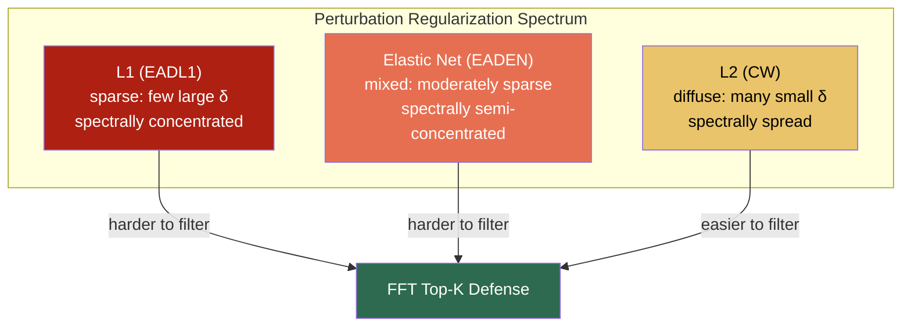
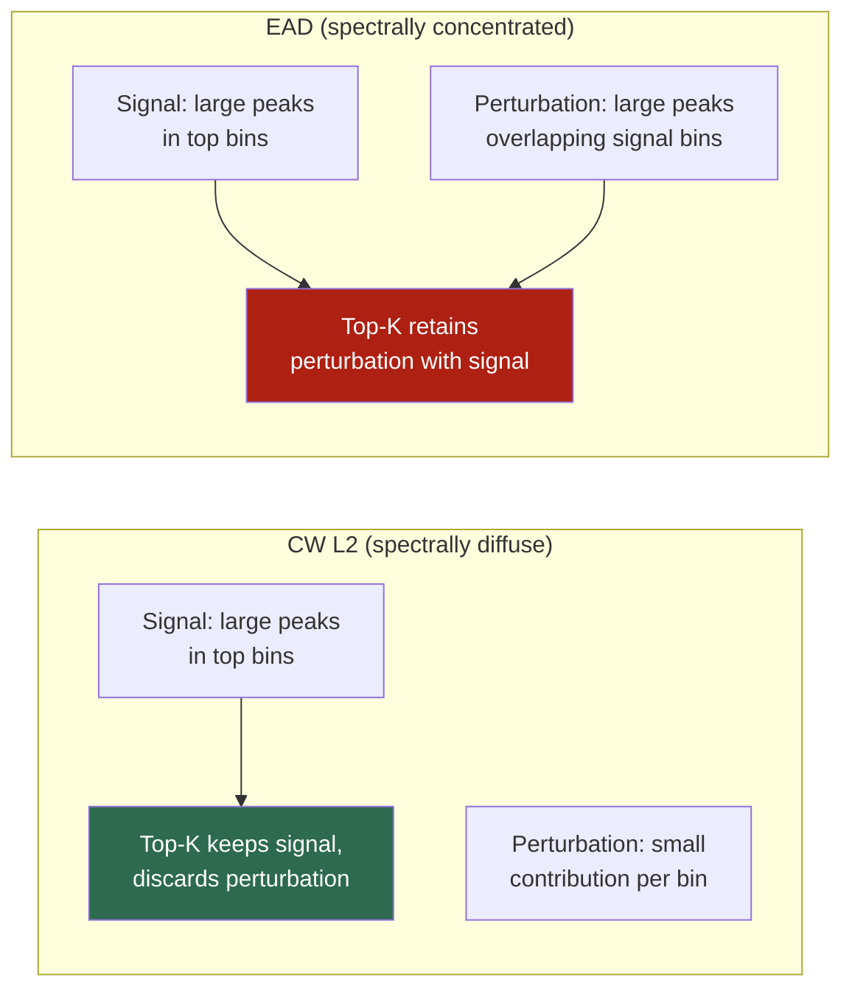
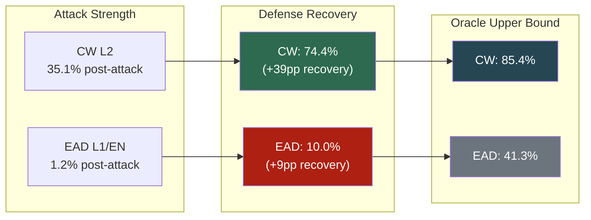
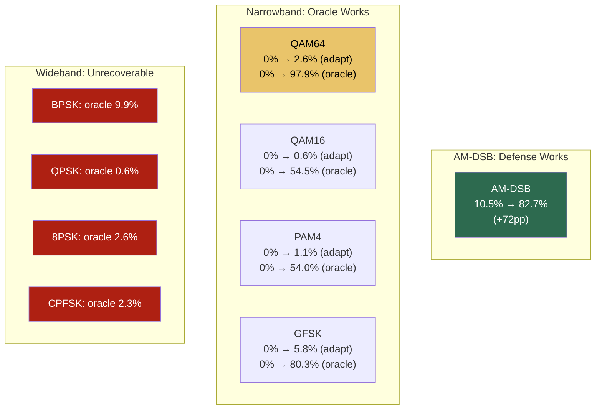
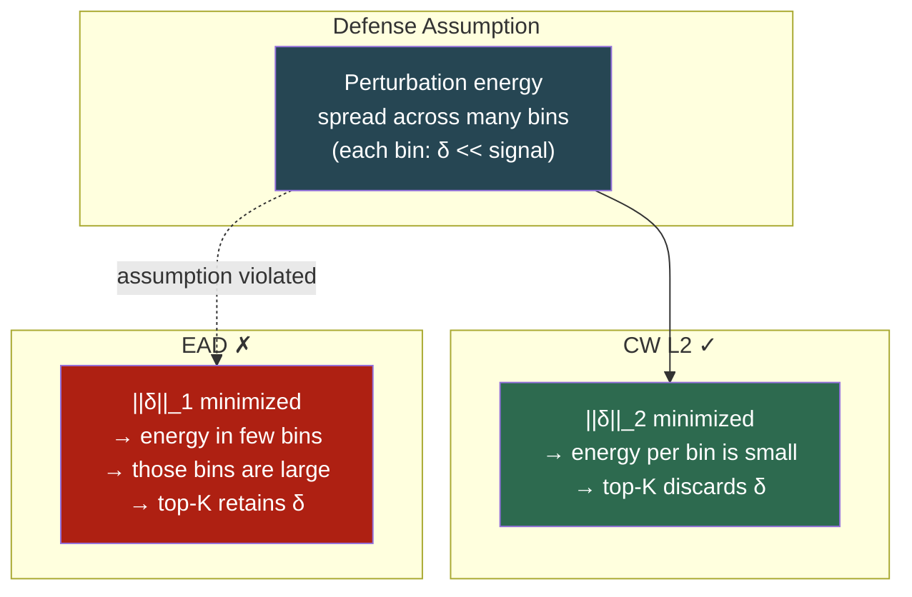

# EAD (Elastic-net Attack to DNNs) vs Adaptive-K FFT Defense

## 1. Motivation

The [Adaptive-K FFT Defense report](adaptive_k_report.md) demonstrated that spectral filtering recovers 74.4% accuracy against CW L2 attacks. CW L2 produces **spectrally diffuse** perturbations — energy spread thinly across many FFT bins — which makes top-K filtering highly effective.

A natural question: *does this defense generalize to other L2-neighborhood attacks that use different regularization?* EAD (Elastic-net Attack to DNNs) introduces L1 and elastic-net penalties that encourage **sparse perturbations**, potentially concentrating attack energy into fewer spectral bins that overlap with the signal's dominant structure. This report evaluates whether the adaptive-K defense remains effective under these conditions.

## 2. Attack Description

### 2.1 EAD Attack Family

EAD extends the CW L2 framework by adding L1 regularization, producing two variants:

| Variant | Loss Function | Penalty | Perturbation Property |
|---------|--------------|---------|----------------------|
| **EADL1** | CW objective + L1 norm | `β · \|\|δ\|\|_1` | Sparse — few large perturbations, many zeros |
| **EADEN** | CW objective + elastic net | `β · \|\|δ\|\|_1 + \|\|δ\|\|_2²` | Mixed — balances sparsity and spread |
| **CW L2** (baseline) | CW objective + L2 norm | `c · \|\|δ\|\|_2²` | Diffuse — energy spread across all dimensions |



### 2.2 Why EAD is Harder to Filter

The L1 penalty encourages the optimizer to concentrate perturbation energy into a small number of time-domain samples, producing large deviations at specific time indices while leaving others unperturbed. In the frequency domain, this translates to:

1. **Fewer but larger perturbation peaks** in the FFT spectrum
2. **Perturbation energy concentrated in bins that overlap with the signal's dominant spectral structure**
3. **Top-K filtering retains attacked bins** because the perturbation magnitude exceeds the signal's own spectral peaks

This is fundamentally different from CW L2, where the perturbation is spread so thinly that signal peaks dominate at every individual bin.



## 3. Experimental Setup

| Parameter | Value |
|-----------|-------|
| Model | AWN (Adaptive Wavelet Network) |
| Dataset | RML2016.10a, test split |
| SNR range | >= 0 dB (10 SNR points) |
| Sample size | 2000 (subset for tractable EAD computation) |
| Normalization | Per-sample minmax to [0,1] |
| Device | AMD GPU (ROCm/HIP) |

### 3.1 Attack Parameters

| Parameter | EADL1 | EADEN | CW L2 (baseline) |
|-----------|-------|-------|-------------------|
| Confidence margin (kappa) | 1.0 | 1.0 | 1.0 |
| Learning rate | 0.01 | 0.01 | 0.001 |
| Max iterations | 200 | 200 | 100 |
| Binary search steps | 1 | 1 | N/A |
| Initial constant | 10.0 | 10.0 | c=1.0 |
| L1 penalty (beta) | 0.01 | 0.01 | N/A |
| Normalization | minmax | minmax | minmax |

> **Note on binary_search_steps=1**: EAD's default binary search (9 steps) is prohibitively slow on IQ signals (~5 min/batch on ROCm GPU). Using 1 step with high initial_const=10.0 achieves comparable attack strength with 9x speedup.

### 3.2 Defense Configuration

Same adaptive-K approach as the CW report:
1. Compute PSD per I/Q channel: `|FFT(x)|²`, averaged over I and Q
2. Sort magnitudes descending, find knee at 5% of peak
3. Keep top-K FFT bins, zero remainder, IFFT back

## 4. Results

### 4.1 Overall Accuracy

| Condition | CW L2 | EADL1 | EADEN |
|-----------|------:|------:|------:|
| Clean (no attack) | 91.15% | 91.15% | 91.15% |
| Attacked (no defense) | 35.10% | 1.20% | 1.20% |
| Best fixed K | 70.54% (K=50) | 24.90% (K=5) | 24.90% (K=3) |
| **Adaptive-K (knee 5%)** | **74.36%** | **10.00%** | **9.95%** |
| Oracle (per-sample best) | 85.43% | 41.30% | 41.10% |



**Key observations:**

1. **EAD is far stronger than CW**: Both EADL1 and EADEN reduce accuracy to 1.2% (vs 35.1% for CW) — a 97% relative attack success rate
2. **Adaptive-K is ineffective against EAD**: Only 10% recovery (vs 74.4% for CW) — the defense mechanism is fundamentally mismatched
3. **Even the oracle ceiling is low**: 41.3% for EAD vs 85.4% for CW — no fixed K works well because the perturbation overlaps signal bins
4. **EADL1 ≈ EADEN**: Both variants produce nearly identical results, suggesting the L1 component dominates

### 4.2 Per-Modulation Breakdown

#### EADL1

| Modulation | Clean | EADL1 | Adaptive-K | Oracle | Avg K |
|------------|------:|------:|-----------:|-------:|------:|
| BPSK | 98.3% | 0.0% | 0.0% | 9.9% | 71 |
| QPSK | 97.6% | 0.0% | 0.0% | 0.6% | 89 |
| 8PSK | 96.8% | 0.0% | 0.0% | 2.6% | 102 |
| QAM16 | 90.4% | 0.0% | 0.6% | 54.5% | 86 |
| QAM64 | 92.2% | 0.0% | 2.6% | 97.9% | 97 |
| PAM4 | 99.5% | 0.0% | 1.1% | 54.0% | 89 |
| CPFSK | 100.0% | 0.0% | 0.0% | 2.3% | 66 |
| GFSK | 98.8% | 0.0% | 5.8% | 80.3% | 56 |
| AM-DSB | 97.4% | 10.5% | 82.7% | 92.1% | 6 |
| AM-SSB | 91.9% | 0.0% | 0.0% | 25.7% | 128 |
| WBFM | 39.1% | 2.2% | 13.4% | 30.2% | 14 |

#### EADEN

| Modulation | Clean | EADEN | Adaptive-K | Oracle | Avg K |
|------------|------:|------:|-----------:|-------:|------:|
| BPSK | 98.3% | 0.0% | 0.0% | 9.9% | 71 |
| QPSK | 97.6% | 0.0% | 0.0% | 0.6% | 89 |
| 8PSK | 96.8% | 0.0% | 0.0% | 2.6% | 102 |
| QAM16 | 90.4% | 0.0% | 0.6% | 53.8% | 86 |
| QAM64 | 92.2% | 0.0% | 3.1% | 97.9% | 96 |
| PAM4 | 99.5% | 0.0% | 1.1% | 54.5% | 89 |
| CPFSK | 100.0% | 0.0% | 0.0% | 2.3% | 66 |
| GFSK | 98.8% | 0.0% | 5.8% | 79.2% | 56 |
| AM-DSB | 97.4% | 10.5% | 82.7% | 92.1% | 6 |
| AM-SSB | 91.9% | 0.0% | 0.0% | 24.8% | 128 |
| WBFM | 39.1% | 2.2% | 12.3% | 30.2% | 14 |

#### Modulation Categories



**Three recovery tiers emerge:**

1. **AM-DSB recovers well (83%)**: Extreme spectral concentration (energy near DC) means even EAD perturbation falls outside the signal's narrow spectral support at K=2
2. **Narrowband mods have high oracle but low adaptive-K**: QAM64 (oracle 98%), GFSK (oracle 80%) — the right K exists but the knee estimator selects too large a K
3. **Wideband PSK/FSK are unrecoverable**: BPSK, QPSK, 8PSK, CPFSK have oracle < 10% — no K value can separate signal from perturbation

### 4.3 Per-Modulation K Sweep

#### EADL1 Recovery per K

| Mod | Clean | Atk | K=2 | K=3 | K=5 | K=8 | K=10 | K=15 | K=20 | K=30 | K=50 | K=64 | Best K |
|--------|------:|----:|----:|----:|----:|----:|-----:|-----:|-----:|-----:|-----:|-----:|-------:|
| BPSK | 98.3% | 0.0% | 8.3% | 2.8% | 0.0% | 0.6% | 0.6% | 0.6% | 1.1% | 0.0% | 1.1% | 0.0% | K=2 |
| QPSK | 97.6% | 0.0% | 0.6% | 0.0% | 0.0% | 0.0% | 0.0% | 0.0% | 0.0% | 0.0% | 0.0% | 0.0% | K=2 |
| 8PSK | 96.8% | 0.0% | 2.1% | 2.1% | 2.6% | 2.6% | 2.6% | 1.6% | 1.6% | 1.6% | 0.0% | 0.0% | K=5 |
| QAM16 | 90.4% | 0.0% | 22.4% | 18.6% | 9.6% | 11.5% | 10.3% | 7.7% | 5.8% | 1.9% | 1.9% | 1.9% | K=2 |
| QAM64 | 92.2% | 0.0% | 38.5% | 64.1% | 87.0% | 84.9% | 86.5% | 77.6% | 72.4% | 58.3% | 30.2% | 10.4% | K=5 |
| PAM4 | 99.5% | 0.0% | 18.0% | 32.8% | 32.3% | 20.6% | 14.8% | 9.0% | 8.5% | 4.2% | 2.6% | 2.1% | K=3 |
| CPFSK | 100.0% | 0.0% | 0.6% | 0.0% | 0.0% | 0.0% | 0.6% | 1.1% | 0.6% | 0.6% | 0.0% | 0.0% | K=15 |
| GFSK | 98.8% | 0.0% | 23.7% | 39.3% | 44.5% | 39.3% | 30.6% | 16.2% | 13.3% | 6.4% | 4.0% | 2.3% | K=5 |
| AM-DSB | 97.4% | 10.5% | 92.1% | 81.2% | 71.7% | 66.5% | 55.0% | 41.4% | 36.1% | 29.3% | 22.5% | 17.8% | K=2 |
| AM-SSB | 91.9% | 0.0% | 0.0% | 0.0% | 0.0% | 0.0% | 0.0% | 0.0% | 1.0% | 11.0% | 21.0% | 14.3% | K=50 |
| WBFM | 39.1% | 2.2% | 16.2% | 25.7% | 20.1% | 17.9% | 16.2% | 12.8% | 11.2% | 7.3% | 3.9% | 2.8% | K=3 |

#### EADEN Recovery per K

| Mod | Clean | Atk | K=2 | K=3 | K=5 | K=8 | K=10 | K=15 | K=20 | K=30 | K=50 | K=64 | Best K |
|--------|------:|----:|----:|----:|----:|----:|-----:|-----:|-----:|-----:|-----:|-----:|-------:|
| BPSK | 98.3% | 0.0% | 8.3% | 2.8% | 0.0% | 0.6% | 0.6% | 0.6% | 1.1% | 0.0% | 1.1% | 0.0% | K=2 |
| QPSK | 97.6% | 0.0% | 0.6% | 0.0% | 0.0% | 0.0% | 0.0% | 0.0% | 0.0% | 0.0% | 0.0% | 0.0% | K=2 |
| 8PSK | 96.8% | 0.0% | 2.1% | 2.1% | 2.6% | 2.6% | 2.6% | 1.6% | 1.6% | 1.6% | 0.0% | 0.0% | K=5 |
| QAM16 | 90.4% | 0.0% | 21.8% | 17.9% | 9.0% | 12.2% | 9.0% | 5.8% | 3.8% | 2.6% | 3.2% | 3.2% | K=2 |
| QAM64 | 92.2% | 0.0% | 43.8% | 67.7% | 85.9% | 84.4% | 84.9% | 76.0% | 67.2% | 49.5% | 24.0% | 12.0% | K=5 |
| PAM4 | 99.5% | 0.0% | 18.0% | 32.8% | 32.8% | 21.2% | 14.8% | 9.5% | 7.9% | 3.7% | 2.1% | 2.6% | K=3 |
| CPFSK | 100.0% | 0.0% | 0.6% | 0.0% | 0.0% | 0.0% | 0.6% | 1.1% | 0.6% | 0.6% | 0.0% | 0.0% | K=15 |
| GFSK | 98.8% | 0.0% | 22.5% | 39.9% | 44.5% | 39.3% | 30.6% | 13.9% | 13.3% | 6.4% | 3.5% | 2.3% | K=5 |
| AM-DSB | 97.4% | 10.5% | 91.6% | 81.2% | 71.7% | 65.4% | 53.4% | 41.4% | 36.1% | 29.3% | 23.0% | 17.8% | K=2 |
| AM-SSB | 91.9% | 0.0% | 0.0% | 0.0% | 0.0% | 0.0% | 0.0% | 0.0% | 1.0% | 10.5% | 20.5% | 14.3% | K=50 |
| WBFM | 39.1% | 2.2% | 16.8% | 25.1% | 20.1% | 17.9% | 16.2% | 14.5% | 14.0% | 9.5% | 4.5% | 3.9% | K=3 |

### 4.4 K Sweep Pattern: EAD vs CW

A striking difference in optimal K between CW and EAD:

| Modulation | CW Best K | EAD Best K | Shift Direction |
|------------|:---------:|:----------:|:---------------:|
| QAM64 | K=10 | K=5 | ← more aggressive |
| PAM4 | K=15 | K=3 | ← much more aggressive |
| GFSK | K=15 | K=5 | ← more aggressive |
| QAM16 | K=20 | K=2 | ← much more aggressive |
| AM-DSB | K=2 | K=2 | — (same) |
| BPSK | K=64 | K=2 | ← radically different |
| QPSK | K=50 | K=2 | ← radically different |
| 8PSK | K=64 | K=5 | ← radically different |
| CPFSK | K=64 | K=15 | ← more aggressive |
| AM-SSB | K=64 | K=50 | ← slightly more aggressive |
| WBFM | K=10 | K=3 | ← more aggressive |

**Pattern**: EAD optimal K is universally lower (more aggressive filtering) than CW. This confirms that EAD perturbation is spectrally concentrated — the only way to remove it is extremely aggressive filtering, which also destroys the signal. The wideband modulations that needed K=50-64 for CW cannot survive such aggressive filtering, explaining why they become unrecoverable.

### 4.5 Per-SNR Breakdown

#### EADL1

| SNR | Clean | Attacked | Adaptive-K | Best Fixed K |
|----:|------:|---------:|-----------:|:-------------|
| 0 | 89.6% | 0.0% | 1.9% | K=3 (25.9%) |
| 2 | 88.4% | 0.0% | 5.3% | K=5 (19.6%) |
| 4 | 91.5% | 0.0% | 7.9% | K=3 (26.5%) |
| 6 | 89.5% | 1.9% | 14.8% | K=3 (26.3%) |
| 8 | 90.1% | 0.5% | 7.9% | K=5 (27.2%) |
| 10 | 95.3% | 2.1% | 13.6% | K=5 (30.4%) |
| 12 | 93.5% | 3.5% | 15.1% | K=5 (30.2%) |
| 14 | 90.8% | 1.4% | 9.2% | K=5 (23.2%) |
| 16 | 91.1% | 1.0% | 10.3% | K=8 (24.6%) |
| 18 | 91.9% | 1.4% | 14.3% | K=5 (31.9%) |

#### EADEN

| SNR | Clean | Attacked | Adaptive-K | Best Fixed K |
|----:|------:|---------:|-----------:|:-------------|
| 0 | 89.6% | 0.0% | 1.9% | K=3 (25.5%) |
| 2 | 88.4% | 0.0% | 5.8% | K=3 (18.5%) |
| 4 | 91.5% | 0.0% | 7.9% | K=3 (27.0%) |
| 6 | 89.5% | 1.9% | 15.3% | K=3 (25.4%) |
| 8 | 90.1% | 0.5% | 8.4% | K=5 (27.2%) |
| 10 | 95.3% | 2.1% | 13.6% | K=5 (30.9%) |
| 12 | 93.5% | 3.5% | 14.6% | K=5 (30.2%) |
| 14 | 90.8% | 1.4% | 8.7% | K=5 (24.2%) |
| 16 | 91.1% | 1.0% | 9.9% | K=8 (25.1%) |
| 18 | 91.9% | 1.4% | 13.8% | K=5 (31.9%) |

**Observations:**
- EAD attack strength is consistent across all SNRs (0-2% attacked accuracy everywhere)
- Adaptive-K provides minimal recovery at all SNR levels (2-15%)
- Best fixed K achieves 19-32% — better than adaptive but still far from useful
- No SNR advantage: unlike CW where high-SNR signals recover better, EAD defeats the defense uniformly

## 5. Cross-Attack Comparison

### 5.1 Summary Table

| Metric | CW L2 | EADL1 | EADEN |
|--------|------:|------:|------:|
| Clean accuracy | 91.15% | 91.15% | 91.15% |
| Attacked accuracy | 35.10% | 1.20% | 1.20% |
| Attack success rate | 61.5% | 98.7% | 98.7% |
| Best fixed K recovery | 70.54% | 24.90% | 24.90% |
| Adaptive-K recovery | 74.36% | 10.00% | 9.95% |
| Oracle recovery | 85.43% | 41.30% | 41.10% |
| Recovery gap (adaptive vs oracle) | 11pp | 31pp | 31pp |
| Defense effectiveness | High | **Ineffective** | **Ineffective** |

### 5.2 Why the Defense Fails Against EAD

The spectral filtering defense exploits a specific property of CW L2 perturbations: they are **spectrally diffuse**. EAD breaks this assumption:

| Property | CW L2 | EAD L1/EN |
|----------|-------|-----------|
| Perturbation sparsity | Dense (all samples perturbed slightly) | Sparse (few samples perturbed significantly) |
| Spectral profile | Flat noise floor elevation | Concentrated peaks |
| Overlap with signal bins | Low — perturbation is below signal peaks | High — perturbation peaks match or exceed signal peaks |
| Top-K filtering effect | Removes perturbation, preserves signal | Retains perturbation with signal |
| Adaptive-K knee estimation | Knee at clean/attack boundary | Knee misled by combined signal+attack magnitude |



### 5.3 The Adaptive-K Overestimation Problem

Under EAD, the adaptive-K estimator selects much larger K values than needed:

| Modulation | Avg K (CW) | Avg K (EAD) | EAD Best K |
|------------|:----------:|:-----------:|:----------:|
| AM-DSB | ~6 | 6 | 2 |
| WBFM | ~10 | 14 | 3 |
| QAM64 | ~33 | 96-97 | 5 |
| GFSK | ~34 | 56 | 5 |
| PAM4 | ~37 | 89 | 3 |
| QAM16 | ~36 | 86 | 2 |
| BPSK | ~52 | 71 | 2 |
| QPSK | ~57 | 89 | 2 |
| 8PSK | ~56 | 102 | 5 |
| CPFSK | ~55 | 66 | 15 |
| AM-SSB | ~128 | 128 | 50 |

The EAD perturbation raises the magnitude of many bins above the 5% threshold, causing the knee estimator to select a very large K (73-102 for most mods). But the optimal K is extremely small (2-5) — only the most aggressive filtering has any chance of removing the perturbation, and even then most modulations cannot be recovered.

## 6. Implications for Defense Design

### 6.1 The Spectral Filtering Ceiling

FFT top-K filtering is a defense tailored to **spectrally diffuse** perturbations. Its effectiveness is bounded by the spectral concentration of the attack:

| Attack spectral profile | Defense effectiveness |
|------------------------|---------------------|
| Diffuse (CW L2) | High — 74% recovery |
| Semi-concentrated (Linf) | Moderate (see SigGuard eval) |
| Concentrated (EAD L1/EN) | **Low — 10% recovery** |

This is not a failure of the adaptive-K estimator specifically — the oracle ceiling (41%) shows that even with perfect K selection, spectral filtering cannot recover most modulations from EAD.

### 6.2 What Would Work Against EAD?

Potential defense approaches for spectrally concentrated attacks:

| Approach | Mechanism | Challenge |
|----------|-----------|-----------|
| **Time-domain denoising** | Exploit sparsity — identify and suppress outlier time samples | Need to distinguish signal peaks from perturbation peaks |
| **Adversarial training** | Train model to be robust to L1 perturbations | Requires attack-specific retraining |
| **Ensemble defense** | Apply multiple K values and vote | Partially explored by oracle — ceiling is 41% |
| **Detection + rejection** | Detect EAD attacks and reject rather than recover | Sparse perturbation pattern may be detectable |
| **Hybrid spectral-temporal** | FFT filtering + time-domain clipping | May address both CW and EAD simultaneously |

### 6.3 Receiver Pipeline Context

The earlier report argued that L2-minimal attacks are the most relevant threat class because spectrally concentrated perturbations are more likely to be detected by RX pipeline stages (AGC, PSD monitors, CFAR). EAD's concentrated spectral profile reinforces this argument:

- EAD perturbations produce **larger per-bin spectral deviations** than CW
- These deviations are more likely to trigger PSD monitors or appear as anomalies
- The higher the perturbation concentration, the more it resembles a jammer or interference — which conventional RF systems are already designed to detect

This suggests a layered defense strategy: conventional RF front-end processing provides implicit defense against spectrally concentrated attacks (EAD, Linf), while spectral filtering addresses the spectrally diffuse attacks (CW) that pass through the front-end.

## 7. Limitations

1. **Sample size**: 2000 samples (subset of 22000) due to EAD computation cost. Results may shift slightly with full dataset.
2. **Single attack strength**: Used initial_const=10.0 with binary_search_steps=1. Different hyperparameters may yield different attack-defense tradeoffs.
3. **Baseband only**: Same caveat as CW report — experiments operate at baseband IQ, not through a full RF front-end simulation.
4. **No time-domain defense tested**: Only evaluated spectral (FFT) filtering. Time-domain approaches might exploit EAD's sparsity property.

## 8. Conclusion

EAD attacks (EADL1 and EADEN) expose a fundamental limitation of spectral filtering defenses. The L1/elastic-net penalty produces **spectrally concentrated** perturbations that overlap with the signal's dominant frequency bins, defeating the core assumption of FFT top-K filtering. While CW L2's spectrally diffuse profile enables 74% recovery, EAD achieves only 10% — and the oracle ceiling of 41% shows this is not merely an estimation problem but a fundamental mismatch between the defense mechanism and the attack's spectral properties.

The positive interpretation: EAD's concentrated spectral profile makes it more likely to be detected or distorted by conventional RF front-end processing stages (PSD monitors, CFAR), suggesting that a layered defense combining front-end anomaly detection with spectral filtering could address both attack families.

## Appendix: Reproduction

```bash
# Run EAD adaptive-K experiment (2000 samples, ~30s per attack)
python -u adaptive_k_ead.py --eval_limit 2000 --batch_size 64

# Full dataset (22000 samples, ~5-10 min per attack)
python -u adaptive_k_ead.py --batch_size 64
```

Script: [`adaptive_k_ead.py`](../adaptive_k_ead.py)
