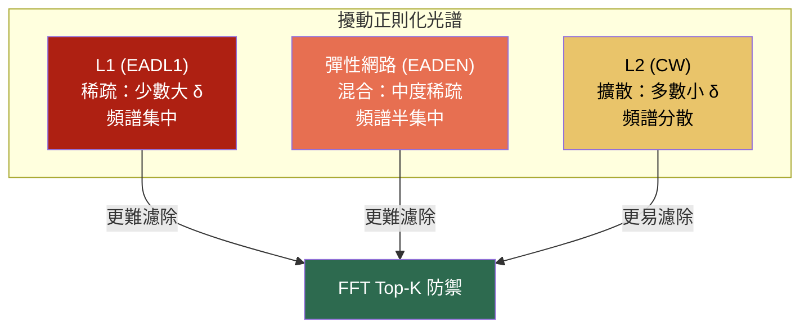
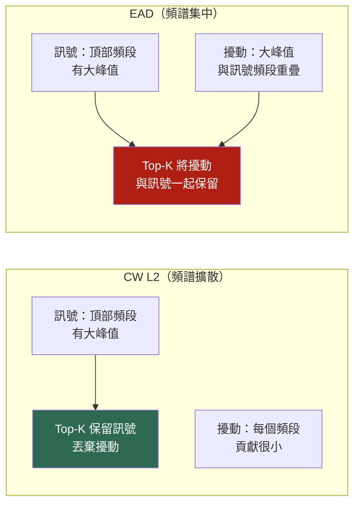
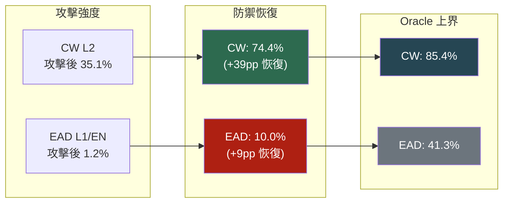
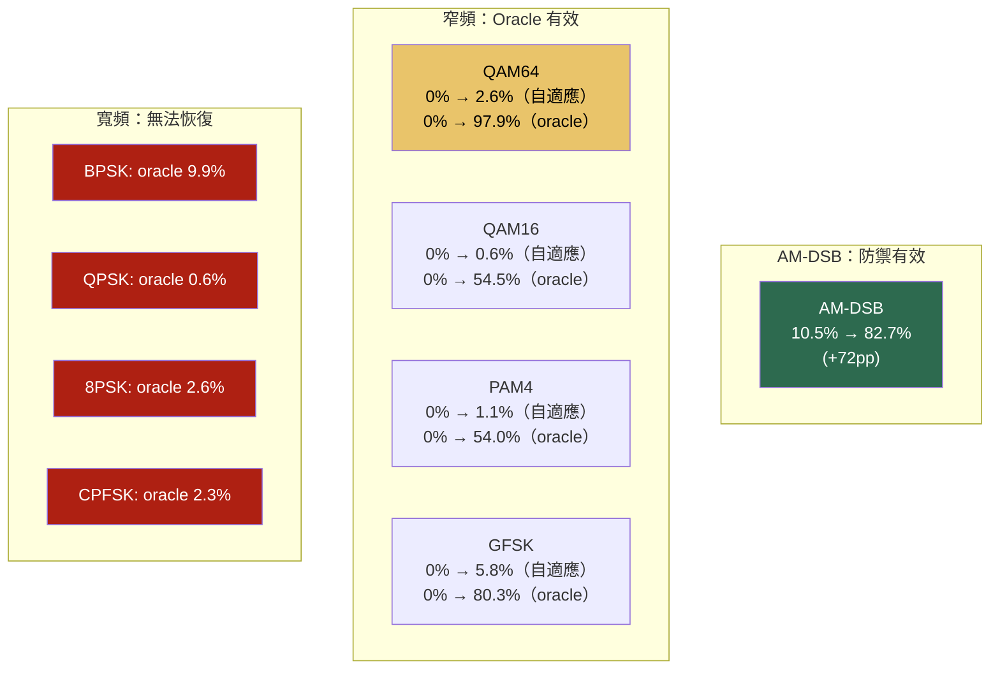
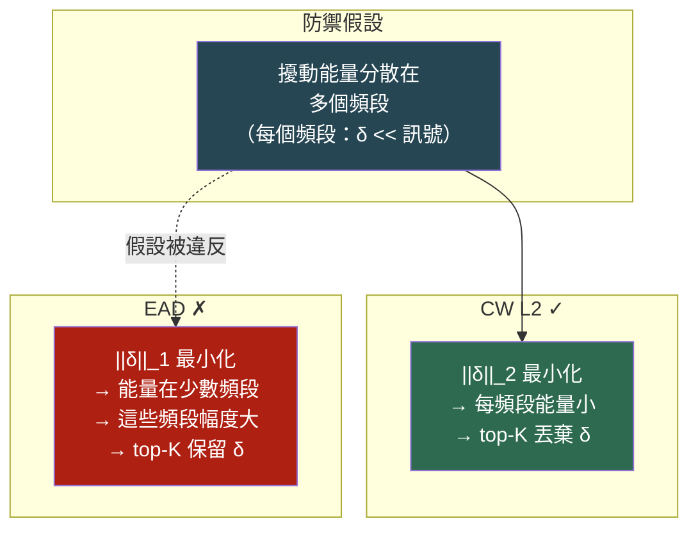

# EAD（彈性網路深度神經網路攻擊）vs 自適應-K FFT 防禦

## 1. 研究動機

[自適應-K FFT 防禦報告](adaptive_k_report.md)證明了頻譜濾波在對抗 CW L2 攻擊時可恢復 74.4% 的準確率。CW L2 產生**頻譜擴散**的擾動 — 能量薄薄地分佈在多個 FFT 頻段上 — 這使得 top-K 濾波非常有效。

一個自然的問題是：*這種防禦是否能推廣到使用不同正則化的其他 L2 鄰域攻擊？* EAD（彈性網路深度神經網路攻擊）引入了 L1 和彈性網路懲罰，鼓勵**稀疏擾動**，可能將攻擊能量集中到較少的頻譜頻段中，與訊號的主要結構重疊。本報告評估自適應-K 防禦在這些條件下是否仍然有效。

## 2. 攻擊描述

### 2.1 EAD 攻擊家族

EAD 通過添加 L1 正則化擴展了 CW L2 框架，產生兩個變體：

| 變體 | 損失函數 | 懲罰項 | 擾動特性 |
|------|---------|--------|---------|
| **EADL1** | CW 目標 + L1 範數 | `β · \|\|δ\|\|_1` | 稀疏 — 少數大擾動，多數為零 |
| **EADEN** | CW 目標 + 彈性網路 | `β · \|\|δ\|\|_1 + \|\|δ\|\|_2²` | 混合 — 平衡稀疏性和擴散性 |
| **CW L2**（基準） | CW 目標 + L2 範數 | `c · \|\|δ\|\|_2²` | 擴散 — 能量分佈在所有維度 |



### 2.2 為什麼 EAD 更難濾除

L1 懲罰鼓勵優化器將擾動能量集中到少數時域樣本中，在特定時間索引處產生大偏差，同時保持其他位置不受干擾。在頻域中，這意味著：

1. **FFT 頻譜中較少但較大的擾動峰值**
2. **擾動能量集中在與訊號主要頻譜結構重疊的頻段中**
3. **Top-K 濾波保留了被攻擊的頻段**，因為擾動幅度超過了訊號自身的頻譜峰值

這與 CW L2 根本不同，在 CW L2 中擾動分佈得非常薄，使得訊號峰值在每個頻段都佔主導地位。



## 3. 實驗設置

| 參數 | 值 |
|------|-----|
| 模型 | AWN（自適應小波網路） |
| 資料集 | RML2016.10a，測試集 |
| SNR 範圍 | >= 0 dB（10 個 SNR 點） |
| 樣本數量 | 2000（子集，用於可行的 EAD 計算） |
| 正規化 | 逐樣本 minmax 到 [0,1] |
| 裝置 | AMD GPU（ROCm/HIP） |

### 3.1 攻擊參數

| 參數 | EADL1 | EADEN | CW L2（基準） |
|------|-------|-------|--------------|
| 信心邊界 (kappa) | 1.0 | 1.0 | 1.0 |
| 學習率 | 0.01 | 0.01 | 0.001 |
| 最大迭代次數 | 200 | 200 | 100 |
| 二分搜尋步數 | 1 | 1 | 不適用 |
| 初始常數 | 10.0 | 10.0 | c=1.0 |
| L1 懲罰 (beta) | 0.01 | 0.01 | 不適用 |
| 正規化 | minmax | minmax | minmax |

> **關於 binary_search_steps=1 的說明**：EAD 預設的二分搜尋（9 步）在 IQ 訊號上極慢（在 ROCm GPU 上約 5 分鐘/批次）。使用 1 步配合高 initial_const=10.0 可達到相當的攻擊強度，速度提升 9 倍。

### 3.2 防禦配置

與 CW 報告相同的自適應-K 方法：
1. 計算每個 I/Q 通道的 PSD：`|FFT(x)|²`，對 I 和 Q 取平均
2. 將幅度降序排列，找到峰值 5% 處的拐點
3. 保留前 K 個 FFT 頻段，將其餘歸零，IFFT 回時域

## 4. 結果

### 4.1 整體準確率

| 條件 | CW L2 | EADL1 | EADEN |
|------|------:|------:|------:|
| 乾淨（無攻擊） | 91.15% | 91.15% | 91.15% |
| 攻擊後（無防禦） | 35.10% | 1.20% | 1.20% |
| 最佳固定 K | 70.54% (K=50) | 24.90% (K=5) | 24.90% (K=3) |
| **自適應-K（拐點 5%）** | **74.36%** | **10.00%** | **9.95%** |
| Oracle（逐樣本最佳） | 85.43% | 41.30% | 41.10% |



**關鍵觀察：**

1. **EAD 遠強於 CW**：EADL1 和 EADEN 都將準確率降至 1.2%（CW 為 35.1%）— 攻擊成功率達 97%
2. **自適應-K 對 EAD 無效**：僅 10% 恢復率（CW 為 74.4%）— 防禦機制根本性地不匹配
3. **即使 Oracle 上限也很低**：EAD 為 41.3% vs CW 的 85.4% — 沒有固定 K 能有效分離訊號與擾動
4. **EADL1 ≈ EADEN**：兩種變體產生幾乎相同的結果，表明 L1 分量佔主導地位

### 4.2 逐調變方式分析

#### EADL1

| 調變方式 | 乾淨 | EADL1 | 自適應-K | Oracle | 平均 K |
|---------|-----:|------:|---------:|-------:|-------:|
| BPSK | 98.3% | 0.0% | 0.0% | 9.9% | 71 |
| QPSK | 97.6% | 0.0% | 0.0% | 0.6% | 89 |
| 8PSK | 96.8% | 0.0% | 0.0% | 2.6% | 102 |
| QAM16 | 90.4% | 0.0% | 0.6% | 54.5% | 86 |
| QAM64 | 92.2% | 0.0% | 2.6% | 97.9% | 97 |
| PAM4 | 99.5% | 0.0% | 1.1% | 54.0% | 89 |
| CPFSK | 100.0% | 0.0% | 0.0% | 2.3% | 66 |
| GFSK | 98.8% | 0.0% | 5.8% | 80.3% | 56 |
| AM-DSB | 97.4% | 10.5% | 82.7% | 92.1% | 6 |
| AM-SSB | 91.9% | 0.0% | 0.0% | 25.7% | 128 |
| WBFM | 39.1% | 2.2% | 13.4% | 30.2% | 14 |

#### EADEN

| 調變方式 | 乾淨 | EADEN | 自適應-K | Oracle | 平均 K |
|---------|-----:|------:|---------:|-------:|-------:|
| BPSK | 98.3% | 0.0% | 0.0% | 9.9% | 71 |
| QPSK | 97.6% | 0.0% | 0.0% | 0.6% | 89 |
| 8PSK | 96.8% | 0.0% | 0.0% | 2.6% | 102 |
| QAM16 | 90.4% | 0.0% | 0.6% | 53.8% | 86 |
| QAM64 | 92.2% | 0.0% | 3.1% | 97.9% | 96 |
| PAM4 | 99.5% | 0.0% | 1.1% | 54.5% | 89 |
| CPFSK | 100.0% | 0.0% | 0.0% | 2.3% | 66 |
| GFSK | 98.8% | 0.0% | 5.8% | 79.2% | 56 |
| AM-DSB | 97.4% | 10.5% | 82.7% | 92.1% | 6 |
| AM-SSB | 91.9% | 0.0% | 0.0% | 24.8% | 128 |
| WBFM | 39.1% | 2.2% | 12.3% | 30.2% | 14 |

#### 調變類別分析



**出現三個恢復層級：**

1. **AM-DSB 恢復良好（83%）**：極端頻譜集中（能量在 DC 附近）意味著即使 EAD 擾動在 K=2 時也落在訊號窄頻支撐之外
2. **窄頻調變有高 Oracle 但低自適應-K**：QAM64（oracle 98%）、GFSK（oracle 80%）— 正確的 K 存在但拐點估計器選擇了過大的 K
3. **寬頻 PSK/FSK 無法恢復**：BPSK、QPSK、8PSK、CPFSK 的 oracle < 10% — 沒有 K 值能分離訊號與擾動

### 4.3 逐調變方式 K 值掃描

#### EADL1 各 K 值恢復

| 調變 | 乾淨 | 攻擊 | K=2 | K=3 | K=5 | K=8 | K=10 | K=15 | K=20 | K=30 | K=50 | K=64 | 最佳 K |
|------|-----:|-----:|----:|----:|----:|----:|-----:|-----:|-----:|-----:|-----:|-----:|-------:|
| BPSK | 98.3% | 0.0% | 8.3% | 2.8% | 0.0% | 0.6% | 0.6% | 0.6% | 1.1% | 0.0% | 1.1% | 0.0% | K=2 |
| QPSK | 97.6% | 0.0% | 0.6% | 0.0% | 0.0% | 0.0% | 0.0% | 0.0% | 0.0% | 0.0% | 0.0% | 0.0% | K=2 |
| 8PSK | 96.8% | 0.0% | 2.1% | 2.1% | 2.6% | 2.6% | 2.6% | 1.6% | 1.6% | 1.6% | 0.0% | 0.0% | K=5 |
| QAM16 | 90.4% | 0.0% | 22.4% | 18.6% | 9.6% | 11.5% | 10.3% | 7.7% | 5.8% | 1.9% | 1.9% | 1.9% | K=2 |
| QAM64 | 92.2% | 0.0% | 38.5% | 64.1% | 87.0% | 84.9% | 86.5% | 77.6% | 72.4% | 58.3% | 30.2% | 10.4% | K=5 |
| PAM4 | 99.5% | 0.0% | 18.0% | 32.8% | 32.3% | 20.6% | 14.8% | 9.0% | 8.5% | 4.2% | 2.6% | 2.1% | K=3 |
| CPFSK | 100.0% | 0.0% | 0.6% | 0.0% | 0.0% | 0.0% | 0.6% | 1.1% | 0.6% | 0.6% | 0.0% | 0.0% | K=15 |
| GFSK | 98.8% | 0.0% | 23.7% | 39.3% | 44.5% | 39.3% | 30.6% | 16.2% | 13.3% | 6.4% | 4.0% | 2.3% | K=5 |
| AM-DSB | 97.4% | 10.5% | 92.1% | 81.2% | 71.7% | 66.5% | 55.0% | 41.4% | 36.1% | 29.3% | 22.5% | 17.8% | K=2 |
| AM-SSB | 91.9% | 0.0% | 0.0% | 0.0% | 0.0% | 0.0% | 0.0% | 0.0% | 1.0% | 11.0% | 21.0% | 14.3% | K=50 |
| WBFM | 39.1% | 2.2% | 16.2% | 25.7% | 20.1% | 17.9% | 16.2% | 12.8% | 11.2% | 7.3% | 3.9% | 2.8% | K=3 |

#### EADEN 各 K 值恢復

| 調變 | 乾淨 | 攻擊 | K=2 | K=3 | K=5 | K=8 | K=10 | K=15 | K=20 | K=30 | K=50 | K=64 | 最佳 K |
|------|-----:|-----:|----:|----:|----:|----:|-----:|-----:|-----:|-----:|-----:|-----:|-------:|
| BPSK | 98.3% | 0.0% | 8.3% | 2.8% | 0.0% | 0.6% | 0.6% | 0.6% | 1.1% | 0.0% | 1.1% | 0.0% | K=2 |
| QPSK | 97.6% | 0.0% | 0.6% | 0.0% | 0.0% | 0.0% | 0.0% | 0.0% | 0.0% | 0.0% | 0.0% | 0.0% | K=2 |
| 8PSK | 96.8% | 0.0% | 2.1% | 2.1% | 2.6% | 2.6% | 2.6% | 1.6% | 1.6% | 1.6% | 0.0% | 0.0% | K=5 |
| QAM16 | 90.4% | 0.0% | 21.8% | 17.9% | 9.0% | 12.2% | 9.0% | 5.8% | 3.8% | 2.6% | 3.2% | 3.2% | K=2 |
| QAM64 | 92.2% | 0.0% | 43.8% | 67.7% | 85.9% | 84.4% | 84.9% | 76.0% | 67.2% | 49.5% | 24.0% | 12.0% | K=5 |
| PAM4 | 99.5% | 0.0% | 18.0% | 32.8% | 32.8% | 21.2% | 14.8% | 9.5% | 7.9% | 3.7% | 2.1% | 2.6% | K=3 |
| CPFSK | 100.0% | 0.0% | 0.6% | 0.0% | 0.0% | 0.0% | 0.6% | 1.1% | 0.6% | 0.6% | 0.0% | 0.0% | K=15 |
| GFSK | 98.8% | 0.0% | 22.5% | 39.9% | 44.5% | 39.3% | 30.6% | 13.9% | 13.3% | 6.4% | 3.5% | 2.3% | K=5 |
| AM-DSB | 97.4% | 10.5% | 91.6% | 81.2% | 71.7% | 65.4% | 53.4% | 41.4% | 36.1% | 29.3% | 23.0% | 17.8% | K=2 |
| AM-SSB | 91.9% | 0.0% | 0.0% | 0.0% | 0.0% | 0.0% | 0.0% | 0.0% | 1.0% | 10.5% | 20.5% | 14.3% | K=50 |
| WBFM | 39.1% | 2.2% | 16.8% | 25.1% | 20.1% | 17.9% | 16.2% | 14.5% | 14.0% | 9.5% | 4.5% | 3.9% | K=3 |

### 4.4 K 值掃描模式：EAD vs CW

CW 和 EAD 之間最佳 K 的顯著差異：

| 調變方式 | CW 最佳 K | EAD 最佳 K | 偏移方向 |
|---------|:---------:|:----------:|:-------:|
| QAM64 | K=10 | K=5 | ← 更激進 |
| PAM4 | K=15 | K=3 | ← 大幅更激進 |
| GFSK | K=15 | K=5 | ← 更激進 |
| QAM16 | K=20 | K=2 | ← 大幅更激進 |
| AM-DSB | K=2 | K=2 | —（相同） |
| BPSK | K=64 | K=2 | ← 根本性改變 |
| QPSK | K=50 | K=2 | ← 根本性改變 |
| 8PSK | K=64 | K=5 | ← 根本性改變 |
| CPFSK | K=64 | K=15 | ← 更激進 |
| AM-SSB | K=64 | K=50 | ← 略更激進 |
| WBFM | K=10 | K=3 | ← 更激進 |

**規律**：EAD 的最佳 K 普遍低於 CW（更激進的濾波）。這證實了 EAD 擾動是頻譜集中的 — 唯一能去除它的方法是極其激進的濾波，但這也會破壞訊號。在 CW 下需要 K=50-64 的寬頻調變方式無法承受如此激進的濾波，這解釋了為什麼它們變得不可恢復。

### 4.5 逐 SNR 分析

#### EADL1

| SNR | 乾淨 | 攻擊後 | 自適應-K | 最佳固定 K |
|----:|-----:|-------:|---------:|:----------|
| 0 | 89.6% | 0.0% | 1.9% | K=3 (25.9%) |
| 2 | 88.4% | 0.0% | 5.3% | K=5 (19.6%) |
| 4 | 91.5% | 0.0% | 7.9% | K=3 (26.5%) |
| 6 | 89.5% | 1.9% | 14.8% | K=3 (26.3%) |
| 8 | 90.1% | 0.5% | 7.9% | K=5 (27.2%) |
| 10 | 95.3% | 2.1% | 13.6% | K=5 (30.4%) |
| 12 | 93.5% | 3.5% | 15.1% | K=5 (30.2%) |
| 14 | 90.8% | 1.4% | 9.2% | K=5 (23.2%) |
| 16 | 91.1% | 1.0% | 10.3% | K=8 (24.6%) |
| 18 | 91.9% | 1.4% | 14.3% | K=5 (31.9%) |

#### EADEN

| SNR | 乾淨 | 攻擊後 | 自適應-K | 最佳固定 K |
|----:|-----:|-------:|---------:|:----------|
| 0 | 89.6% | 0.0% | 1.9% | K=3 (25.5%) |
| 2 | 88.4% | 0.0% | 5.8% | K=3 (18.5%) |
| 4 | 91.5% | 0.0% | 7.9% | K=3 (27.0%) |
| 6 | 89.5% | 1.9% | 15.3% | K=3 (25.4%) |
| 8 | 90.1% | 0.5% | 8.4% | K=5 (27.2%) |
| 10 | 95.3% | 2.1% | 13.6% | K=5 (30.9%) |
| 12 | 93.5% | 3.5% | 14.6% | K=5 (30.2%) |
| 14 | 90.8% | 1.4% | 8.7% | K=5 (24.2%) |
| 16 | 91.1% | 1.0% | 9.9% | K=8 (25.1%) |
| 18 | 91.9% | 1.4% | 13.8% | K=5 (31.9%) |

**觀察：**
- EAD 攻擊強度在所有 SNR 上一致（攻擊後準確率 0-2%）
- 自適應-K 在所有 SNR 水準提供的恢復極少（2-15%）
- 最佳固定 K 達到 19-32% — 優於自適應但仍遠不實用
- 無 SNR 優勢：與 CW 中高 SNR 訊號恢復更好不同，EAD 均勻地擊敗防禦

## 5. 跨攻擊比較

### 5.1 摘要表

| 指標 | CW L2 | EADL1 | EADEN |
|------|------:|------:|------:|
| 乾淨準確率 | 91.15% | 91.15% | 91.15% |
| 攻擊後準確率 | 35.10% | 1.20% | 1.20% |
| 攻擊成功率 | 61.5% | 98.7% | 98.7% |
| 最佳固定 K 恢復 | 70.54% | 24.90% | 24.90% |
| 自適應-K 恢復 | 74.36% | 10.00% | 9.95% |
| Oracle 恢復 | 85.43% | 41.30% | 41.10% |
| 恢復差距（自適應 vs oracle） | 11pp | 31pp | 31pp |
| 防禦有效性 | 高 | **無效** | **無效** |

### 5.2 為什麼防禦對 EAD 失效

頻譜濾波防禦利用了 CW L2 擾動的特定屬性：它們是**頻譜擴散**的。EAD 打破了這一假設：

| 屬性 | CW L2 | EAD L1/EN |
|------|-------|-----------|
| 擾動稀疏性 | 密集（所有樣本輕微擾動） | 稀疏（少數樣本顯著擾動） |
| 頻譜特徵 | 平坦噪底抬升 | 集中峰值 |
| 與訊號頻段重疊 | 低 — 擾動低於訊號峰值 | 高 — 擾動峰值匹配或超過訊號峰值 |
| Top-K 濾波效果 | 移除擾動，保留訊號 | 與訊號一起保留擾動 |
| 自適應-K 拐點估計 | 拐點在乾淨/攻擊邊界 | 拐點被合併的訊號+攻擊幅度誤導 |



### 5.3 自適應-K 過度估計問題

在 EAD 下，自適應-K 估計器選擇了遠大於所需的 K 值：

| 調變方式 | 平均 K（CW） | 平均 K（EAD） | EAD 最佳 K |
|---------|:----------:|:-----------:|:----------:|
| AM-DSB | ~6 | 6 | 2 |
| WBFM | ~10 | 14 | 3 |
| QAM64 | ~33 | 96-97 | 5 |
| GFSK | ~34 | 56 | 5 |
| PAM4 | ~37 | 89 | 3 |
| QAM16 | ~36 | 86 | 2 |
| BPSK | ~52 | 71 | 2 |
| QPSK | ~57 | 89 | 2 |
| 8PSK | ~56 | 102 | 5 |
| CPFSK | ~55 | 66 | 15 |
| AM-SSB | ~128 | 128 | 50 |

EAD 擾動將許多頻段的幅度提高到 5% 閾值以上，導致拐點估計器選擇非常大的 K（大多數調變為 73-102）。但最佳 K 極小（2-5）— 只有最激進的濾波才有機會去除擾動，即便如此大多數調變方式也無法恢復。

## 6. 防禦設計的啟示

### 6.1 頻譜濾波的上限

FFT top-K 濾波是一種針對**頻譜擴散**擾動的防禦。其有效性受攻擊頻譜集中度的限制：

| 攻擊頻譜特徵 | 防禦有效性 |
|-------------|-----------|
| 擴散（CW L2） | 高 — 74% 恢復 |
| 半集中（Linf） | 中等（見 SigGuard 評估） |
| 集中（EAD L1/EN） | **低 — 10% 恢復** |

這不僅僅是自適應-K 估計器的問題 — Oracle 上限（41%）表明即使有完美的 K 選擇，頻譜濾波也無法從 EAD 恢復大多數調變方式。

### 6.2 什麼能對抗 EAD？

針對頻譜集中攻擊的潛在防禦方法：

| 方法 | 機制 | 挑戰 |
|------|------|------|
| **時域去噪** | 利用稀疏性 — 識別並抑制異常時域樣本 | 需要區分訊號峰值和擾動峰值 |
| **對抗訓練** | 訓練模型對 L1 擾動具有魯棒性 | 需要針對特定攻擊重新訓練 |
| **集成防禦** | 應用多個 K 值並投票 | Oracle 部分探索 — 上限為 41% |
| **檢測 + 拒絕** | 檢測 EAD 攻擊並拒絕而非恢復 | 稀疏擾動模式可能可被檢測 |
| **混合頻譜-時域** | FFT 濾波 + 時域裁剪 | 可能同時對抗 CW 和 EAD |

### 6.3 接收器管線上下文

先前的報告論證了 L2 最小攻擊是最相關的威脅類別，因為頻譜集中的擾動更容易被 RX 管線階段（AGC、PSD 監測、CFAR）檢測到。EAD 的集中頻譜特徵強化了這一論點：

- EAD 擾動產生比 CW **更大的逐頻段頻譜偏差**
- 這些偏差更容易觸發 PSD 監測或表現為異常
- 擾動越集中，就越像干擾器或干擾源 — 而傳統 RF 系統本就設計用來檢測這些

這建議了分層防禦策略：傳統 RF 前端處理提供對頻譜集中攻擊（EAD、Linf）的隱性防禦，而頻譜濾波則處理通過前端的頻譜擴散攻擊（CW）。

## 7. 限制

1. **樣本量**：由於 EAD 計算成本，使用 2000 個樣本（22000 的子集）。完整資料集的結果可能略有偏移。
2. **單一攻擊強度**：使用 initial_const=10.0 和 binary_search_steps=1。不同的超參數可能產生不同的攻擊-防禦權衡。
3. **僅基頻**：與 CW 報告相同的注意事項 — 實驗在基頻 IQ 上操作，而非通過完整的 RF 前端模擬。
4. **未測試時域防禦**：僅評估了頻譜（FFT）濾波。時域方法可能利用 EAD 的稀疏性。

## 8. 結論

EAD 攻擊（EADL1 和 EADEN）暴露了頻譜濾波防禦的根本限制。L1/彈性網路懲罰產生**頻譜集中**的擾動，與訊號的主要頻率頻段重疊，打破了 FFT top-K 濾波的核心假設。CW L2 的頻譜擴散特徵實現了 74% 的恢復，而 EAD 僅達到 10% — Oracle 上限 41% 表明這不僅是估計問題，而是防禦機制與攻擊頻譜特性之間的根本性不匹配。

正面解讀：EAD 的集中頻譜特徵使其更容易被傳統 RF 前端處理階段（PSD 監測、CFAR）檢測或扭曲，這意味著結合前端異常檢測與頻譜濾波的分層防禦可以同時應對兩種攻擊家族。

## 附錄：實驗重現

```bash
# 執行 EAD 自適應-K 實驗（2000 樣本，每次攻擊約 30 秒）
python -u adaptive_k_ead.py --eval_limit 2000 --batch_size 64

# 完整資料集（22000 樣本，每次攻擊約 5-10 分鐘）
python -u adaptive_k_ead.py --batch_size 64
```

腳本：[`adaptive_k_ead.py`](../adaptive_k_ead.py)
